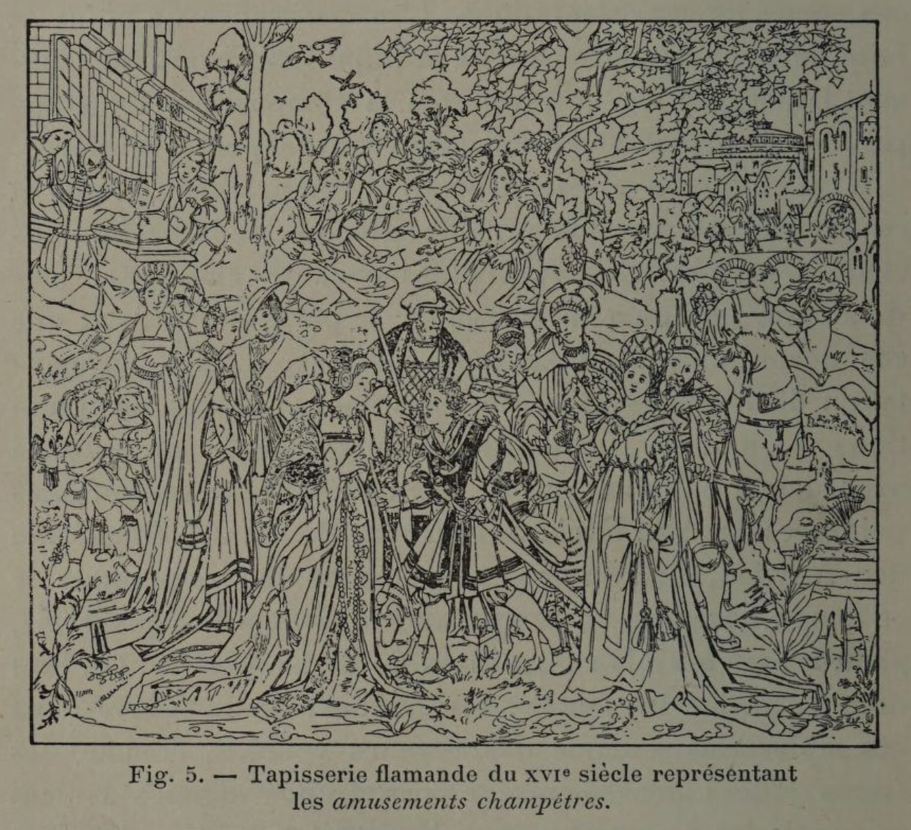
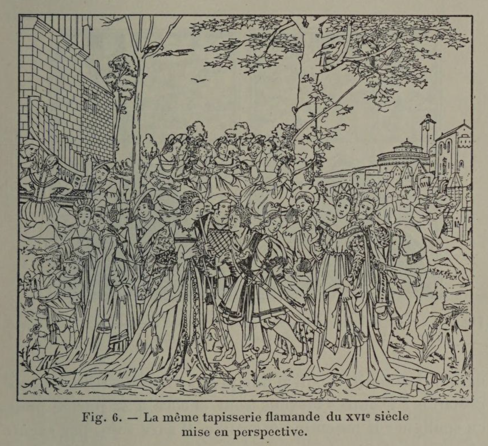
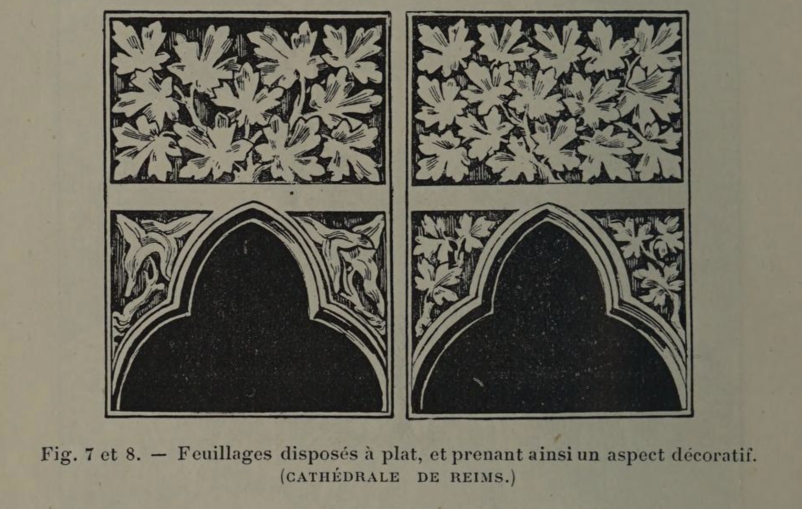
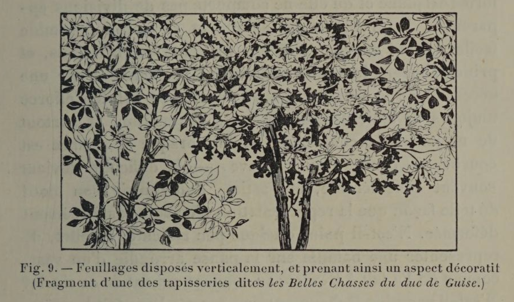

# Perfect perspective = a hole in the wall

## Original (French)

**V. — COMME CONSÉQUENCE, DANS TOUTE DÉCORATION, NON SEULEMENT LIMITATION STRICTE DE LA NATURE NEST POINT INDISPENSABLE, MAIS L'ARTISTE DOIT ENCORE SE GARDER DE DONNER A SES COMPOSITIONS UN ASPECT TROP RÉEL. PAR CONTRE IL PEUT, TANT AU POINT DE VUE DE LA FORME QUE DE LA COULEUR, S ABANDONNER AUX CAPRICES D'UNE ÉLÉGANTE FANTAISIE ET INTERPRÉTER AVEC UNE CERTAINE LIBERTÉ LES SUJETS QUIL SE PROPOSE DE RENDRE.**

Nous venons d'établir que dans le choix de ses sujets le décorateur expérimenté évite tous ceux qui peuvent produire une émotion intense. Mais ce choix n’est point toujours laissé à la disposition de l'artiste. Il lui est souvent imposé, et les motifs qu'on lui indique rentrent parfois dans la catégorie de ceux que nous venons de proscrire. Dans ce cas, il n'oublie jamais combien il serait dangereux de provoquer une illusion, et dès lors, se souvenant que l’imitation stricte de la nature n’a et ne peut avoir d’autre but que de créer cette illusion, il se garde de cette imitation avec une attention toute particulière.

Est-il, par une nécessité supérieure, obligé de représenter un fait historique ? Il aura soin, par une transposition de tons, par un assoupissement général de sa composition, de particulariser suffisamment la scène qu’il traduit, et de la distinguer ainsi du monde réel qui l’entoure, de façon à rendre toute confusion impossible. Il pourra, en outre, par un encadrement plus ou moins compliqué, par une bordure plus ou moins riche, souligner la portée ornementale de son œuvre. Vingt moyens, au surplus, sont à sa disposition pour accentuer le caractère conventionnel, indispensable à ces sortes de représentations. L'inobservance du point de fuite, le mauvais placement de la ligne d'horizon, en faussant la perspective, enlèveront à la composition toute apparence de profondeur et lui donneront l’aspect d’un décor.

C'est ce qu'ont remarquablement compris les Chinois et ce qui leur a valu pendant si longtemps, de la part de nos artistes, les plus vives et les plus mordantes critiques; jusqu’au jour où l’on a fini par saisir le parti merveilleux que ces décorateurs si intelligents tiraient, dans l’ornementation de leurs tissus et de leurs vases, de ces incorrections volontaires. Nos tapissiers du xv° siècle, au reste, ne procédaient point autrement, et en présence des admirables peintures des Van Eyck, des Thierry Bouts, des Roger van der Weyden, etc., on ne peut prétendre que les peintres de ce temps, auxquels on demandait les cartons de tapisseries, aient ignoré les lois rigoureuses de la perspective. On doit donc regarder les fautes , les erreurs, qu'on relève dans ces tapisseries, comme des erreurs voulues, comme des fautes jugées nécessaires; et ces grands artistes avaient raison de les commettre, car le résultat qu'ils obtenaient ainsi devenait plus conforme aux lois de la décoration.

Le principal effet d'une perspective bien observée est de faire un trou dans le mur. Or une ouverture, de quelque nature qu’elle puisse être; alors même qu’elle donnerait jour sur le plus riant paysage, ou qu’elle nous permettrait de contempler le plus magnifique palais, ne saurait être considérée comme un décor. Un vitrail, un rideau, au contraire, un store, une toile, voilant cette ouverture, produiront, dans certains cas, un effet très décoratif. Eh bien, une perspective mal observée, en détruisant la succession logique des plans et en empêchant que la peinture ne se creuse, transforme celle-ci en une sorte de rideau et répond, par conséquent, aux exigences décoratives.

Nos deux figures 5 et 6, qui placent à côté d’une tapisserie du xvi° siècle la scène représentée par cette tapisserie mise dans sa perspective rigoureuse, montrent quelles impressions très différentes peuvent naître de la contemplation d’un même sujet, suivant qu’il est exécuté d’une façon correcte ou avec des incorrections voulues. La première donne la sensation d’une tapisserie, la seconde troue le mur et présente l’aspect d’un tableau. Faut-il ajouter que même dans les peintures décoratives les plus accomplies, dans les chefs-d'œuvre les moins discutés, on rencontre de ces fautes volontaires? L'École d'Athènes offre deux points de vue, l’un, plus bas, pour l'architecture; l’autre, plus haut, pour les figures; et les Noces de Cana de Paul Véronèse présentent deux lignes d'horizon

Certains détails d'exécution qui passent souvent inaperçus ou dont on ne pénètre pas de suite la raison, aident également à produire ces illusions si nécessaires. Il n’est personne qui n’ait remarqué la façon très particulière dont les feuillages sont traités dans les bas-reliefs de l’époque ogivale et dans les anciennes tapisseries dites de verdure. Les feuilles y sont disposées sur un plan vertical, et en quelque sorte à plat. (Voir fig. 7, 8 et 9.) Eh bien, cette disposition, qui, au premier abord, semble accuser une certaine naïveté dans l’exécution, est, au contraire, d'une ingéniosité extrême. Les fleurs, les feuillages, les vols d'oiseaux, présentés ainsi verticalement, revêtent un aspect décoratif qu'ils cessent d’avoir dès qu'on les dessine sur un plan horizontal, et comme ils s'offrent, du reste, à nos regards dans la nature.

On voit que, tenu de traiter un sujet fixé, déterminé à l'avance, le décorateur ne manque pas d'artifices pour imprimer à ce sujet un caractère s’harmonisant avec sa destination. Le motif est-il moins précis et prête-t-il à l'interprétation ? D'autres moyens sont encore à sa portée pour en souligner la fonction décorative. Il aura soin, par exemple, d'introduire dans sa composition une certaine fantaisie, de mêler le fantastique au réel, et de donner ainsi à l’ensemble de son œuvre un aspect suffisamment conventionnel, qui en accentuera la mission.

Supposons qu'on demande à notre décorateur de composer, pour un meuble de salon, une suite de tapisseries représentant les fables de La Fontaine ou celles de Florian. Qui ne sent combien il serait malséant de donner à la ménagerie qui constitue le personnel de ces fables, un aspect trop réel, et quelle inconvenance il y aurait à faire asseoir les gens au milieu de prés verdoyants, de montagnes, de chutes d’eau, sur des loups, des agneaux, des paons, des chiens, des renards ou des ânes ? L'artiste, dans ce cas, a pour devoir de recourir à des compromis gracieux, qui détruisant toute illusion, font oublier à la personne à laquelle on offre un siège, ce que le sujet choisi pour la décoration de ce siège peut avoir d’insolite.

## Translation

**V — In decoration, strict imitation of nature is not only unnecessary, but the artist must also avoid making things look too real. Instead, both in form and color, he may allow himself a degree of elegant invention and interpret his subject with some freedom.**

We have already established that an experienced decorator avoids subjects that produce strong emotional reactions. But this choice is not always up to the artist. Sometimes the subject is imposed, and it may belong to the very category he would prefer to avoid.

In such cases, he must remember how dangerous illusion can be. Since the strict imitation of nature exists only to create that illusion, he must take particular care to avoid it.

If he is required, for example, to represent a historical event, he will soften the tones and subdue the overall composition so that the scene is clearly distinguished from the real world around it, preventing any confusion. He may also emphasize its decorative role through framing or borders. Many techniques are available to reinforce this necessary “decorative” character. For instance, by disregarding the vanishing point or placing the horizon incorrectly, he can disrupt the perspective, remove the sense of depth, and give the work the appearance of a decorative backdrop rather than a realistic scene.

This is something Chinese artists understood very well—despite long being criticized for it. Likewise, 15th-century European tapestry makers worked in the same way. Given the sophistication of painters like Jan van Eyck, Thierry Bouts, and Rogier van der Weyden, it would be absurd to think they were unaware of correct perspective. The distortions we see in tapestries from this period are deliberate. They are intentional “errors,” chosen because they better serve the purposes of decoration.

The primary effect of correct perspective is to create the illusion of depth—to open a hole in the wall. But an opening, no matter how beautiful the view it reveals, is not decoration. A curtain, a textile, or a screen covering that opening, on the other hand, can be highly decorative. In the same way, imperfect perspective prevents an image from receding into depth and instead makes it read as a surface—like a hanging fabric—which satisfies the needs of decoration.

Figures 5 and 6 illustrate this clearly: they show the same subject rendered in two ways—once as a tapestry, and once with correct perspective. The first reads as decoration; the second reads as a picture that breaks through the wall. The difference in effect is immediate.

Even in the most celebrated works of decorative painting, these intentional inconsistencies appear. In The School of Athens, the architecture and the figures are drawn from different viewpoints. In Veronese’s Wedding at Cana, there are two horizon lines.

Other details—often overlooked—also contribute to this effect. Consider how foliage is treated in Gothic reliefs and in traditional verdure tapestries. The leaves are arranged flat, on a vertical plane. At first glance, this may seem naïve, but it is actually highly sophisticated. When foliage is presented this way, it reads as decorative. If it were rendered as it appears in nature—tilted and spatial—it would lose that quality.

When the decorator must work with a fixed subject, he has many ways to adapt it to its purpose. If the subject allows more freedom, he can go further—introducing fantasy, blending the real with the imaginary, and giving the composition a deliberately stylized character that reinforces its decorative role.

For example, if a decorator is asked to design upholstery for a salon based on the fables of La Fontaine or Florian, it would be inappropriate to render the animals too realistically. Imagine sitting on a chair surrounded by convincingly depicted wolves, foxes, or donkeys—it would feel absurd. Instead, the artist must soften and stylize the imagery, creating a graceful compromise that removes any sense of reality and allows the object to remain comfortable and appropriate in use.

## Images

_Fig. 5. — 16th-century Flemish tapestry depicting rural amusements._

_Fig. 6. — The same 15th-century Flemish tapestry, placed in perspective._

_Fig. 7 and 8. — Foliage arranged flat, thus assuming a decorative appearance. (REIMS CATHEDRAL.)_

_Fig. 9. — Foliage arranged vertically, thereby assuming a decorative aspect. (Fragment of one of the tapestries known as Les Belles Chasses du duc de Guise.)_
