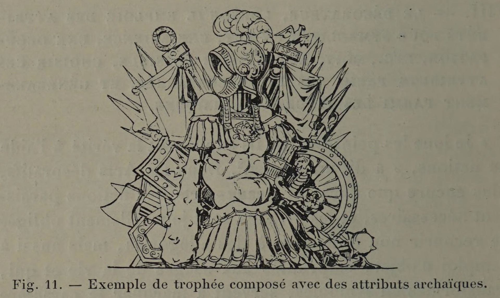

# Use symbols people already understand.

## Original (French)

**VIII. — LE DÉCORATEUR, LORSQU'IL EMPLOIE DES ATTRIBUTS POUR SYMBOLISER UN ART, UNE SCIENCE, UNE OCCUPATION, ETC., DOIT, AUTANT QUE POSSIBLE, CHOISIR CES ATTRIBUTS PARMI LES TYPES CONSACRÉS, ET GÉNÉRALEMENT PARMI LES FIGURES ARCHAÏQUES.**

« Je loue les peintres, car ils expriment la vérité à l’aide de fictions, » a dit un Ancien?. Dans les Arts décoratifs, plus encore que dans les Beaux-Arts, les fictions paraissent nécessaires, et les artistes sont journellement obligés de recourir non seulement à des allégories, mais aussi à l'emploi d'objets empruntés aux usages de la vie et qui, transformés en symboles, servent à marquer le caractère spécial de certaines figures, à déterminer leurs qualités essentielles ou à fixer leur personnalité. Ces objets symboliques prennent le nom d’attributs. La balance et le glaive, par exemple, sont les attributs de la Justice; la trompette, celui de la Renommée ; la roue est l’attribut de la Fortune, On donne également ce même nom à des faisceaux ou à des groupements d'objets caractérisant une occupation, une science ou un art, et qui, ingénieusement combinés, fournissent non seulement des motifs de décoration agréables, mais encore constituent d'élégants hisroel- pie Fe avec un peu d'attention, la lecture doit demeurer facile.

Ajoutons que les attributs ne servent pas seulement à caractériser les personnages. De tout temps ils ont été employés par les architectes pour préciser la destination des édifices. C’est ainsi que les métopes du temple de Délos, consacré à Apollon, étaient décorées de lyres. Jadis Les temples dédiés à Neptune étaient ornés d'éperons de navire et de gouvernails. L'entrée des théâtres était signalée par des masques tragiques et comiques. De nos jours, une croix placée au-dessus d’une porte désigne une chapelle, un séminaire, un couvent. Des casques et des trophées indiquent une caserne. La plupart des enseignes ingénieuses et pittoresques qui se prélassaient autrefois au-dessus des portes, sortes d'armes parlantes de nos arts et métiers, symbolisaient par des attributs la profession de celui dont elles ornaïent la demeure. Enfin, même dans la décoration intérieure, ces sortes d’emblèmes, choisis avec intelligence et employés avec discrétion, peuvent indiquer la destination d’une pièce, en même temps qu'ils concourent à sa décoration. Des faisceaux groupant les attributs de la pêche ou de la chasse conviennent parfaitement à une salle à manger; des instruments de musique, des livres, des cahiers, à une salle de concert ou un salon de compagnie, etc.

Dans le choix des objets composant ces hiéroglyphes, le décorateur habile accorde la préférence aux figures archaïques, qui, étant consacrées par le temps, doivent à cette consécration de mieux conserver leur apparence symbolique. « Comme ces anciens ornements jouissent du droit de possession, remarque, à ce propos, le peintre anglais Reynolds1, on ne doit les abandonner que lorsqu'on peut les remplacer par d’autres qui non seulement sont plus beaux, mais qui peuvent balancer la confusion et le désordre qui résultent toujours de l'innovation. » Enfin le décorateur, s’il est forcé de recourir, faute d’équivalents, à la représentation d'objets relativement modernes, évite avec soin de donner à ces objets un aspect trop réel, qui atténuerait certainement leur valeur emblématique.

1 Œuvres complètes du chevalier Josué Reynolds ; Paris, 1806, tome Ier, p. 305.

## Translation

**VIII — When the decorator uses attributes to symbolize an art, a science, an occupation, and so on, he should, whenever possible, choose established symbols, and generally those of archaic form.**

“I praise painters, for they express truth by means of fictions,” said one of the ancients.

In the decorative arts, even more than in the fine arts, such fictions seem necessary. Artists are constantly obliged to make use not only of allegories, but also of ordinary objects taken from daily life which, transformed into symbols, serve to define the special character of certain figures, indicate their essential qualities, or establish their identity.

These symbolic objects are called attributes.

For example:

- the scales and sword are the attributes of Justice
- the trumpet is the attribute of Fame
- the wheel is the attribute of Fortune

The same term also applies to grouped collections of objects representing an occupation, science, or art. Skillfully arranged, these not only provide pleasing decorative motifs, but also form elegant hieroglyphs whose meaning, if one looks with a little attention, remains easy to read.

Attributes are not used only to characterize figures. They have long been employed by architects to indicate the purpose of buildings.

Thus:

- the metopes of the temple of Delos, dedicated to Apollo, were decorated with lyres
- temples of Neptune were adorned with ship prows and rudders
- theaters were marked by tragic and comic masks

In modern times:

- a cross above a door signifies a chapel, seminary, or convent
- helmets and trophies indicate a barracks

Many of the picturesque old shop signs once hung above doorways—speaking emblems of trades and professions—used attributes to symbolize the occupation of the person within.

Even in interior decoration, such emblems, intelligently chosen and discreetly used, may indicate the purpose of a room while also contributing to its ornament.

For example:

- grouped fishing or hunting implements suit a dining room
- musical instruments, books, and manuscripts suit a music room or salon

In choosing the objects that compose these hieroglyphs, the skillful decorator prefers archaic forms, because being sanctioned by time, they better preserve their symbolic meaning.

As the English painter Joshua Reynolds observed:

> “Since these ancient ornaments possess the right of long usage, they should only be abandoned when replaced by others not only more beautiful, but capable of offsetting the confusion and disorder that innovation always brings.”1

Finally, if the decorator is forced—through lack of equivalents—to use relatively modern objects, he must take care not to render them too realistically, for that would weaken their symbolic force.

1 Complete Works of Sir Joshua Reynolds; Paris, 1806, Vol. I, p. 305.

## Images

_Fig. 11. — Example of a trophy composed of archaic attributes._
