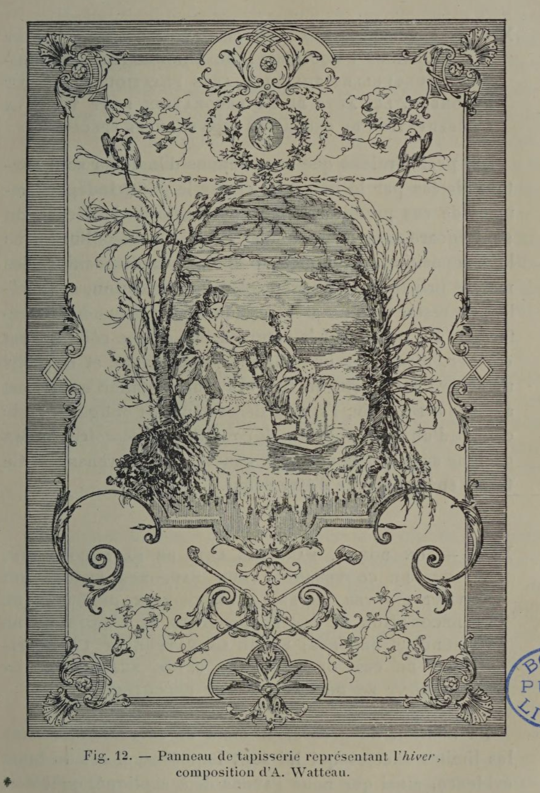

# The imagery should match the climate and light of the room.

## Original (French)

**XI. — ENFIN, LA NATURE DES SUJETS REPRÉSENTÉS DOIT ÉGALEMENT S HARMONISER AVEC LE DEGRÉ D'ÉCLAIRAGE ET DE TEMPÉRATURE AUQUEL LA DÉCORATION EST ORDINAIREMENT SOUMISE. ES**

Dans le choix et dans l'interprétation de ses sujets, le décorateur est encore tenu à d’autres précautions, découlant de la température et de l'éclairage de la pièce qu'il est chargé d’embellir. Des effets de nuit, par exemple, sont assez mal placés sur un mur et dans un appartement destinés à recevoir une abondante lumière. Le contraste entre l'obscurité cherchée et l'éclairage des parties avoisinantes ne peut produire qu'un résultat discordant. De même il est quelque peu malséant de figurer un paysage glacé avec des arbres couverts de givre ou de neige, sur la muraille d’une salle à manger ou d’un boudoir, appelés par leur destination à jouir en tout temps d’une atmosphère tempérée.

Mais, nous l’avons déjà dit, il arrive souvent que le choix des sujets n’est pas laissé au décorateur; et ces motifs mal appropriés lui sont imposés par la personne dont il tient la commande ou par son architecte. Dans ce cas, notre artiste peut résoudre le problème en donnant à la scène qu'il représente un aspect suffisamment conventionnel. Lui demande-t-on de figurer les Saisons : il symbolisera l'hiver sous la forme d’un vieillard accroupi et se chauffant, d'enfants entourant un foyer, ou, si cela paraît un peu vieillot, il dessinera de gracieux patineurs, comme le fit Watteau (voir fig. 12), mais en prenant soin d'envelopper la scène d’arabesques qui assignent à cette représentation un caractère exclusivement décoratif. Exige-t-on qu'il prenne pour sujet de sa décoration une série d'actions se reliant entre elles, empruntées à la fable, à l’histoire ou au roman, et comprenant des épisodes qui s'accordent mal avec la clarté ou la température de la pièce : il aura soin d’enfermer chacun de ses épisodes dans un cartouche agréablement dessiné; et en isolant ainsi sa composition, il évitera le désaccord fâcheux que produirait le voisinage immédiat de parois soumises à un éclairage plus intense ou à une température différente.

_Fig. 12. — Panneau de tapisserie représentant l'hiver, composition d'A. Watteau._

## Translation

**XI — Finally, the nature of the subjects represented should also harmonize with the degree of light and temperature to which the decoration is ordinarily exposed.**

In choosing and interpreting his subjects, the decorator must observe further precautions arising from the usual temperature and lighting of the room he is asked to embellish.

Night scenes, for example, are rather poorly placed on a wall in an apartment intended to receive abundant light. The contrast between the sought-after darkness of the image and the brightness of the surrounding space can only produce a discordant effect.

Likewise, it is somewhat inappropriate to depict a frozen landscape—with trees covered in frost or snow—on the wall of a dining room or boudoir, rooms whose purpose calls for a temperate and agreeable atmosphere at all times.

But, as we have already said, the decorator is often not free to choose the subject. Such poorly suited themes may be imposed by the client or by the architect.

In that case, the artist can solve the problem by giving the scene a sufficiently conventional or stylized appearance.

If he is asked to represent the Seasons, he may symbolize Winter as an old man crouching to warm himself, or children gathered around a fire; or, if that seems too old-fashioned, he may depict graceful skaters, as Antoine Watteau did (see fig. 12), while taking care to surround the scene with arabesques that clearly mark it as decorative rather than literal.

If he is required to illustrate a sequence of actions drawn from fable, history, or the novel—and some episodes conflict with the brightness or warmth of the room—he should enclose each scene within an elegantly designed cartouche. By isolating the composition in this way, he avoids the disagreeable contrast that would result from placing such imagery directly against walls subject to stronger light or a different atmosphere.

_Fig. 12. — Tapestry panel depicting Winter, composition by A. Watteau._
