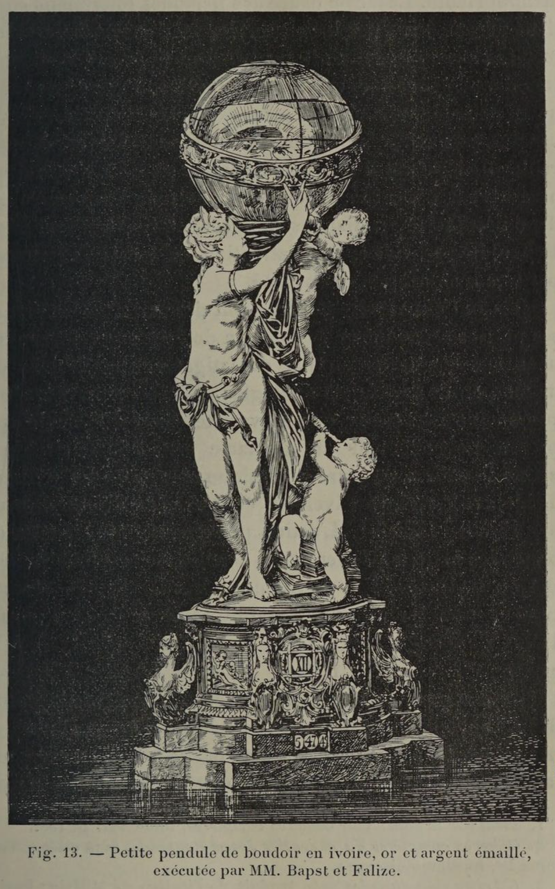

# Use comes first; decoration must never impair function.

## Original (French)

**XIV. — LORSQU'UN OBJET COMPORTE UNE DESTINATION PRÉCISE; LORSQU'IL A ÉTÉ CONÇU ET EXÉCUTÉ DANS UN BUT D UTILITÉ; SURTOUT LORSQUE SA PRINCIPALE RAISON D'ÉTRE RÉSULTE DE L'USAGE QU'ON EN FAIT, LE DÉSIR DE L'EMBELLIR NE DOIT JAMAIS CONTRARIER CE BUT NI DÉGUISER CETTE RAISON D'ÊTRE.**

Indépendamment des devoirs que nous venons d’énumérer, 1l en est d’autres encore qui incombent au décorateur. Celui-ci doit, notamment, tenir le plus grand compte de l'emploi habituel, de l’usage, de la destination de l’objet ou de la surface dont l’ornementation lui est confiée. Rien, dans l'invention et la disposition de son ornementation, ne doit déguiser, dissimuler, faire oublier cette destination ou cet usage; surtout lorsqu'ils sont la raison d’être de l’objet décoré. Ainsi l'artiste qui, chargé de la composition d’une pendule ou de la décoration d’un cadran d’'horloge, dispose son modèle de telle manière que les indications de l'aiguille soient difficilement visibles ou que la constatation de l'heure nécessite une recherche, un effort, cet artiste commet un contresens. Dans quel but, en effet, et pour quel usage construit-on les pendules et les horloges? C’est pour connaître la marche du temps. L'unique raison d’être de ces appareils est de nous permettre de suivre et de contrôler facilement cette marche. Tout ce qui vient à l’encontre est donc fâcheux et condamnable, même lorsque l'artiste, comme dans notre figure 13, est parvenu à composer un groupe charmant, qu'il a exécuté ensuite dans les matières les plus rares et les plus précieuses.

Prenons un autre exemple. Nous demandons à un sculpteur en bois de confectionner un tabouret de salon. Il fait ce tabouret carré, à quatre pieds, suivant les principes de son art; et pour plus de solidité, il relie les quatre pieds par : un croisillon; puis il dispose sur ce croisillon — dans l’entrejambe par conséquent de son tabouret — le motif principal de son ornementation. Eh bien! notre sculpteur commet, lui aussi, une hérésie contre le bon sens, car il perd de vue l'usage et la destination du meuble qu’on lui demande. Celui-ci, étant construit pour servir de siège, ne peut être placé que sur le sol; il sera, par suite, considéré de haut, et dès lors sa partie décorée, si elle est disposée entre les pieds, demeurera forcément invisible.

## Translation

**XIV — When an object has a specific purpose, when it has been designed and made for practical use, and especially when its principal reason for existing lies in that use, the desire to embellish it must never obstruct that purpose or disguise the reason for its existence.**

Beyond the obligations we have just listed, others still fall to the decorator.

He must take the greatest account of the ordinary use, function, and purpose of the object or surface whose ornamentation is entrusted to him.

Nothing in the invention or arrangement of the decoration should conceal, obscure, or make one forget that purpose or use—especially when that use is the very reason the object exists.

For example, an artist asked to design a clock or decorate a clock face, who arranges it in such a way that the hands are difficult to read, or that telling the time requires searching or effort, commits an absurdity.

For what purpose are clocks made?

To know the passage of time.

Their sole reason for being is to allow us to follow and measure it easily. Anything that works against this is regrettable and blameworthy, even if the artist has produced, as in figure 13, a charming composition executed in the rarest and most precious materials.

Let us take another example.

We ask a wood sculptor to make a salon stool. He builds it square, with four legs, according to sound principles, and for greater strength connects the legs with cross braces. Then, on this cross-bracing—in the space between the legs—he places the principal motif of his decoration.

Here again, the sculptor commits an offense against common sense, because he loses sight of the use and purpose of the object requested.

Since the stool is made to serve as a seat, it can only stand on the floor and will therefore be seen from above. The decorated portion, placed between the legs, will necessarily remain invisible.

## Images

_Fig. 13. — Small boudoir clock in ivory, gold, and enameled silver, executed by Messrs. Bapst and Falize._
