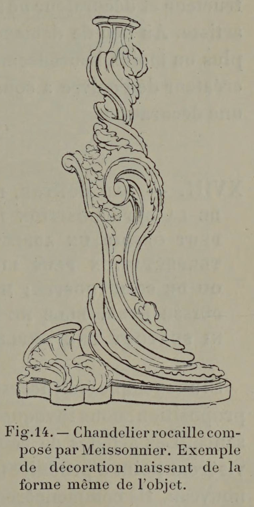

# There are two kinds of decoration: generated ornament and attached ornament.

## Original (French)

**XVI. — LA DÉCORATION D'UNE SURFACE OU D'UN OBJET PEUT DÉCOULER DE SA FORME MÈME ET FAIRE CORPS AVEC ELLE ; ELLE PEUT PROVENIR, AU CONTRAIRE, DE L'ADJONCTION D'ORNEMENTS MOBILES OU INDÉPENDANTS DE LA FORME GÉNÉRALE, ET SUPERPOSÉS À CELLE-CI.**

Lorsque le décorateur est appelé à prendre un parti, la forme (surface ou objet) qu'il est chargé d’embellir exerce naturellement sur son choix une influence considérable. C'est elle qui fournit le thème sur lequel son esprit va s'exercer; elle détermine les limites de son intervention, et par ses divisions principales elle commande forcément la localisation et la disposition générale du décor. Aussi le comble de l’habileté et du bonheur pour l'artiste consistet-il, — lorsque la chose est possible, — à trouver le point de départ de son ornementation dans la forme même de la surface ou de l’objet, et à faire découler la décoration tout entière de cette forme. Prenez un flambeau Louis XV (voir fig. 14); toute son ornementation procède de la torsion donnée à sa tige, c’est-à-dire qu’elle naît, en quelque sorte, spontanément de la structure de ce flambeau. De même pour ces délicieuses formettes qui garnissent les fenêtres de nos églises ogivales. Mais cette bonne chance échoit rarement à l'artiste, et le plus souvent celui-ci doit se borner à surajouter à des formes préexistantes une suite d’ornements indépendants, et qui ne se rattachent à l’ensemble de la construction que par une communauté de pensée ou de style.

## Translation

**XVI — The decoration of a surface or object may arise from its very form and become one with it; or, on the contrary, it may result from the addition of movable or independent ornaments superimposed upon the general form.**

When the decorator is called upon to make a design decision, the form of the thing he is asked to embellish—whether surface or object—naturally exerts considerable influence on his choice.

It provides the theme upon which his mind must work. It determines the limits of his intervention. By its principal divisions, it necessarily governs the placement and general arrangement of the decoration.

Thus the height of skill and good fortune for the artist consists—when possible—in finding the starting point of the ornament within the very form of the surface or object, and causing the whole decoration to grow out of that form.

Take a Louis XV candlestick (see fig. 14): all its ornament proceeds from the twist given to its stem. That is to say, the decoration is born, as it were, spontaneously from the structure of the object itself.

The same may be said of those delightful tracery forms that fill the windows of Gothic churches.

But such happy opportunities come rarely to the artist.

More often he must content himself with adding to pre-existing forms a series of independent ornaments that relate to the construction only through a common spirit or style.

## Images

_Fig. 14.— Rocaille candlestick: a perfect example of decoration arising from the very form of the object itself._
