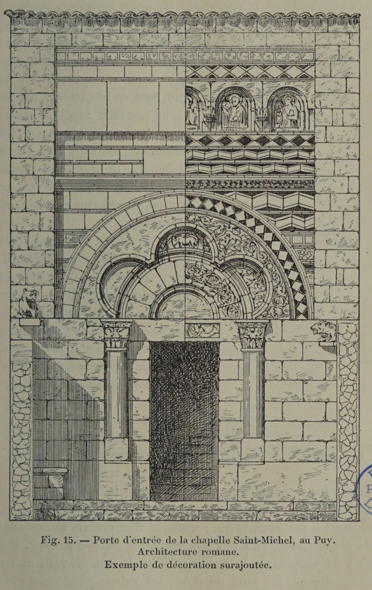
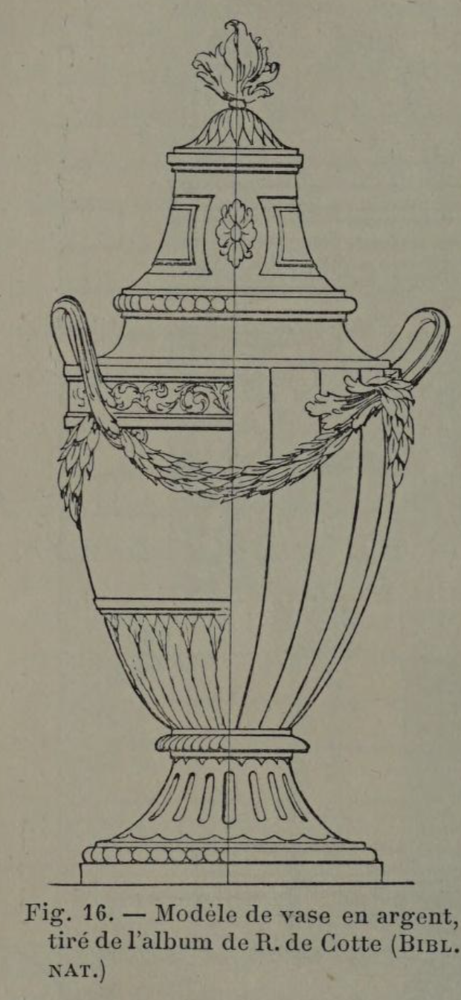

# Applied ornament can be brilliant—but integrated ornament is deeper.

## Original (French)

**XVIII. — PAR CONTRE, LORSQUE LA DÉCORATION PROCÈDE DE LA SUPERPOSITION D'ORNEMENTS INDÉPENDANTS, ELLE PEUT OFFRIR UN ASPECT PLUS VARIÉ, OBÉIR A UNE INTERPRÉTATION PLUS LIBRE, MARQUER PLUS DE FINESSE OU DE SOMPTUOSITÉ ; MAIS, QUELQUE ORIGINALE QU'ELLE PUISSE ÈTRE, ELLE NE PRÉSENTE NI LA MÊME SAVEUR, NI SURTOUT UNE AMPLEUR AUSSI GRANDE.**

Siunexemple étaitnécessaire pour attester la vérité de cette proposition, nous invoquerions le témoignage de la Renaissance. Les artistes de cette époque brillante et féconde ne visèrent point à produire tout d’une pièce un artabsolument nouveau. Ils commencèrent par accepter bravement les formes que l'usage avait consacrées, et quand ils éprouvèrent le besoin de renouveler ces formes, c’est en remontant vers un passé très lointain, en demandant à ce passé leur propre inspiration, en lui empruntant ses grandes lignes, ses proportions, ses formules, qu’ils arrivèrent à créer ces gracieux compromis qui, à force de recherche et de grâce, s'imposent encore à notre admiration. Puis ils rajeunirent ces réminiscences par la juxtaposition d’ornements dessinés avec une sûreté singulière de goût, avec un rare bonheur d'invention, avec un raffinement particulier d'élégance, qu'on n’a pas dépassés depuis. Mais il est facile de s’apercevoir que cette charmante décoration ne fait point corps avec les formes principales, et que, tout en respectant cellesci, on pourrait modifier, enlever, remplacer la plupart de ces motifs exquis, Sans que, sinon la beauté, du moins le caractère général de l’œuvre se trouvât transformé d’une façon essentielle.

Ce que nous venons de dire de la Renaissance peut s’appliquer à d’autres styles éclos à des époques bien distantes. La période romane affecte avec moins d'éclat et de grâce, mais avec encore plus de puissance, cette indépendance de la décoration ; et l’ornementation surchargée, parfois même prolixe, qui s’incruste dans les lignes si fermement écrites de ceux de NOS VIEUX MOnUMENIS remontant à ce temps lointain, ne tent à leur structure par aucun lien précis. Le constructeur a bien indiqué la hauteur du chapiteau, la largeur des frises, la courbe des archivoltes; mais le décorateur, s’emparant de ces surfaces, en a fait son champ d’activité propre. Il a pris du coup toute la responsabilité de son travail, et les imbrications, les jeux de fond, les reliefs plus ou moins accentués qu'il développe sur ces surfaces, constituent une œuvre dont il peut revendiquer l'entière propriété (voir fig. 15). Il en va de même pour cette période charmante de hotre ameublement, qu'on appelle le style Louis XVI. La délicate parure de ces meubles exquis se rattache à leur charpente par des nœuds tellement lâches que, presque toujours, l’auteur a pris soin, dans son croquis initial, d'indiquer lui-même divers motifs qui peuvent indifféremment s'inscrire dans les parties réservées à l’ornementation (voir fig. 16).

Cette décoration surajoutée est susceptible d’une grande somptuosité. C’est à elle qu’appartiennent les merveilleux bronzes de Boulle, dont le superbe “éclat fait si magistralement chanter les placages d’ébène, d’étain et d’écaille. C'est à elle que nous devons ces frises ciselées avec un art Si parfait, ces mascarons, ces guirlandes et ces chutes pour lesquelles Chancelier, Prieur, Delarche, Hervieu, l'illustre Gouthière et les frères Thomire épuisèrent les ressources de leur incomparable ciselet. Mais si riche, si délicate qu’elle puisse être, elle ne comporte jamais cette ampleur magistrale, cette saveur généreuse, cette mâle beauté, et surtout cette logique qu'offre à nos yeux une ornementation découlant de la forme même.

## Translation

**XVIII. — By contrast, when decoration is created by adding separate, independent ornaments onto a form, it may appear more varied, allow greater freedom of interpretation, and show more delicacy or luxury; but however original it may be, it never has the same richness of character, nor above all the same grandeur.**

If an example were needed to prove this proposition, we could point to the Renaissance.

The artists of that brilliant and fertile age did not aim to invent an entirely new art all at once. They first accepted the forms already established by custom; and when they felt the need to renew those forms, they did so by looking back to a distant past, drawing inspiration from it, borrowing its major lines, its proportions, and its formulas. In this way they created those graceful compromises which, through elegance and thoughtful refinement, still command our admiration.

They then refreshed those inherited forms by adding ornaments designed with remarkable certainty of taste, rare inventiveness, and a refinement of elegance that has never been surpassed.

But it is easy to see that this charming decoration does not become one with the principal forms, and that, while respecting those forms, one could alter, remove, or replace most of these exquisite motifs without essentially changing the general character of the work—if not its beauty, then at least its character.

What we have said of the Renaissance may also be applied to other styles that arose in very different periods.

The Romanesque period shows this same independence of decoration—with less brilliance and grace, but with even greater power. The overloaded ornamentation, sometimes even excessively verbose, which is inlaid into the firmly drawn lines of our old monuments dating from that distant time, is connected to their structure by no precise bond.

The builder determined the height of the capital, the width of the friezes, and the curve of the archivolts; but the decorator, taking possession of these surfaces, made them his own field of action.

He thus assumed full responsibility for his work, and the interlacings, background patterns, and reliefs of varying depth that he developed across those surfaces constitute a work whose ownership he may claim entirely (see fig. 15).

The same is true of that charming phase of our furniture known as the Louis XVI style.

The delicate adornment of those exquisite pieces is attached to their framework by ties so loose that, in most cases, the designer took care in the original sketch to indicate several different motifs that could just as well be inserted into the spaces reserved for ornament (see fig. 16).

This applied decoration is capable of great magnificence.

To it belong the marvelous bronzes of André-Charles Boulle, whose splendid brilliance makes veneers of ebony, pewter, and tortoiseshell sing so magnificently.

To it we owe those friezes chased with such perfect skill, those mascarons, those garlands, and those pendant drops for which Chancelier, Prieur, Delarche, Hervieu, the illustrious Pierre Gouthière, and the Thomire brothers exhausted the resources of their incomparable chisels.

But however rich and delicate it may be, this kind of decoration never possesses that commanding breadth, that generous richness, that vigorous beauty, and above all that logic which ornament growing directly from the form itself presents to the eye.

## Images

_Fig. 15. — Entrance door of the Chapel of Saint Michael, Le Puy. Romanesque architecture. An example of superimposed decoration._

_Fig. 16. — Model of a silver vase, taken from R. de Cotte's album (NATIONAL LIBRARY)_
