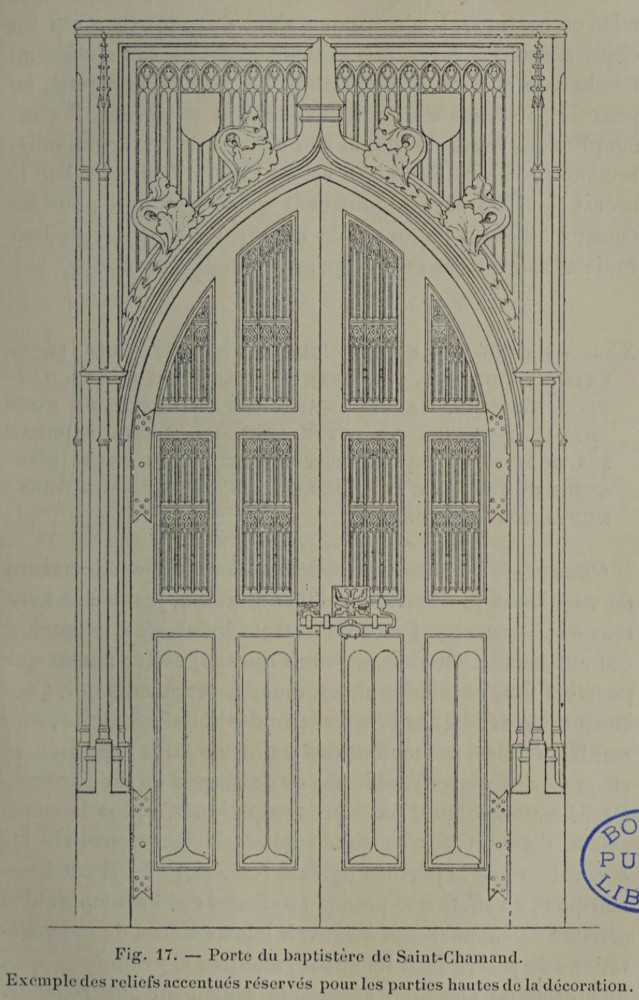

# Design the lower room for the body, the upper room for the eye.

## Original (French)

**XXI. —— DANS LES RELIEFS QUE COMPORTENT LES DÉCORATIONS MURALES, L’ARTISTE EST TENU, JUSQU A LA HAUTEUR D'HOMME, D'AVOIR ÉGARD AUX EXIGENCES DU TOUCHER ; AU-DESSUS DE CETTE HAUTEUR, L'ŒIL REPREND SES DROITS, ET LE DÉCORATEUR REDEVIENT LIBRE D ACCUSER COMME IL L'ENTEND LES SAILLIES QUE SON ORNEMENTATION COMPORTE.**

Cette règle est encore de celles qu'il ne faut jamais perdre de vue. Dans la décoration d’une muraille, jusqu’à la hauteur où l’homme peut couramment atteindre, c’est le toucher qui commande. On doit, en conséquence, éviter autant que possible tous les angles aigus, tous les ornements qui, s’accusant par des lignes brisées, par des reliefs dentelés, diamantés, étoilés, présentent des pointes ou des aspérités, et risquent de froisser l’'épiderme ou de blesser en cas de chute. Passé cette hauteur, cette préoccupation n’a plus la même raison d’être. C’est ce qu'ont admirablement compris les décorateurs de la période ogivale (voir fig. 17). Il est à remarquer, en effet, que presque toujours ces imcomparables artistes ne commencent à couvrir leurs édifices de ces végétations de pierre dont ils se sont montrés si prodigues, qu'à une certaine élévation accessible seulement aux regards.

## Translation

**XXI. — In the reliefs used in wall decoration, the artist is obliged, up to the height a person can reach, to consider the demands of touch; above that height, the eye resumes its rights, and the decorator is again free to emphasize projections and reliefs as he wishes.**

This is another rule that should never be forgotten.

In the decoration of a wall, up to the height ordinarily reachable by a person, touch governs.

Accordingly, one should avoid as much as possible:

- sharp angles
- ornaments defined by broken lines
- serrated reliefs
- faceted or diamonded projections
- star-like forms
- points or rough projections

all of which may scrape the skin or cause injury in the event of a fall.

Above that height, this concern no longer has the same force.

This is something the decorators of the Gothic period understood admirably (see fig. 17).

It is worth noting that these incomparable artists almost always began covering their buildings with those luxuriant stone growths for which they were so lavish only at a certain elevation—one accessible to the eye alone.

## Images

_Fig. 17. - Door of the Saint-Chamand Baptistery. An example of the accentuated reliefs reserved for the upper sections of the decoration._
