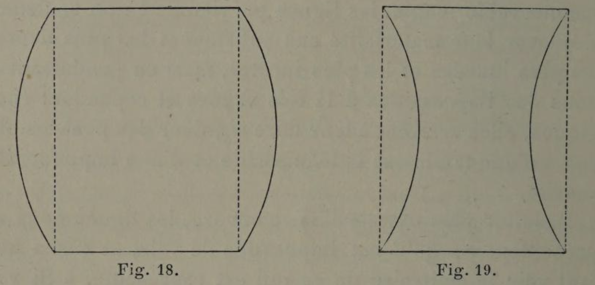

# Line communicates emotionally just as color does.

## Original (French)

**XXV. — COMME LES COULEURS, LES LIGNES ONT AUSSI LEUR LANGAGE. SUIVANT LEUR NATURE ET LA PLACE QU'ELLES OCCUPENT, SUIVANT LES CONTOURS QU'ELLES AIDENT A FORMER, ELLES PEUVENT IMPRESSIONNER NOTRE INTELLIGENCE ET PROVOQUER L'ÉCLOSION DE SENTIMENTS PARTICULIERS.**

Ce que nous venons de dire des couleurs s'applique également aux lignes. Celles-ci possèdent une signification sentimentale moins évidente peut-être, mais dont l'artiste sait tirer un parti plus considérable encore, et qu’en tout cas il n’est permis à personne de méconnaître. Grâce à elles, le spectateur peut éprouver des impressions sublimes et d'autant plus extraordinaires que ces impressions sont obtenues par des moyens qui semblent en contradiction complète avec le résultat cherché. Spectacle invraisemblable ! C'est par l’entassement des blocs de marbre, de granit, ou de pierre de taille, qu’on arrive à produire en nous les sentiments les plus tendres et les plus élevés. C’est de la matière-la plus pesante, la moins maniable, que se dégage, que jaillit ce qu'il y a dans l’imagination humaine de plus délicat, de plus enthousiaste et de plus éthéré. Par une inconcevable magie, les lignes parviennent non seulement à enlever leur matérialité aux substances les plus denses, les plus lourdes et les plus inertes, mais en produisant en nous des impressions à la fois vagues et cependant énergiques, elles arrivent à leur faire signifier des pensées obscures d’une tendresse indéfinissable et d'une impondérable suavité.

Résultat plus extraordinaire encore, les lignes nous représentent ce qu'il est impossible de voir, et même nous font voir le contraire de ce qui est représenté. Il importe, toutefois, de constater que la surprenante impression produite par la contemplation des lignes n’a rien d’absolu. Il en est des formes comme des couleurs, dont l'effet $e trouve modifié par des rapprochements plus ou moins avantageux. Les lignes, en effet, ne jouissent pas, comme l’a écrit M. Charles Blanc, de l’immuable privilège de conserver leur caractère, « quels que soient le moment et le lieu où on les regarde » 1. La courbure d’un arc peut être fort belle en soi, majestueuse, émouvante, et perdre une partie de ses qualités par un voisinage malencontreux2, ou paraître écrasée par l'insuffisance des piedsdroits qui supportent sa retombée. Deux courbes de même rayon, selon la position qu’elles occupent, suffisent à donner au galbe d’un vase un aspect absolument différent. Placées en dedans ou en dehors des lignes.d’aplomb, formant un parallélogramme, elles donnent naissance, suivant le cas à une potiche ou à un cornet (voir fig. 18 et 19).

Ces quelques observations suffisent, semble-t-il, à montrer combien l'étude que nous commençons est à la fois intéressante et complexe ; car ce n’est pas seulement de la signification propre des lignes et des couleurs que l'artiste doit se préoccuper. Il lui faut tenir compte aussi des rapports que ces lignes et ces couleurs peuvent avoir entre elles, et des règles qui gouvernent ces rapports.

1 Grammaire des arts du dessin, p. 24.

2 Comme cela a lieu, par exemple, dans la facade de la gare du Nord, où la présence d’un rampant passant au-dessus d’un cintre, en déforme la courbe.

## Translation

XXV. — Like colors, lines also have their own language. According to their nature and the place they occupy, according to the contours they help to form, they can affect our minds and give rise to particular feelings.

What we have just said of colors applies equally to lines.

Lines possess an emotional significance perhaps less obvious, but one from which the artist knows how to draw even greater advantage, and which no one is permitted to ignore.

Through them, the spectator may experience sublime impressions—impressions all the more extraordinary because they are obtained by means seemingly in complete contradiction with the result sought.

What an improbable spectacle:

It is through the piling up of blocks of marble, granite, or cut stone that one succeeds in producing within us the tenderest and loftiest feelings.

It is from matter that is heaviest and least pliant that there emerges—bursts forth—that which in the human imagination is most delicate, most exalted, and most ethereal.

By an inconceivable magic, lines succeed not only in stripping the densest, heaviest, most inert substances of their materiality, but, by producing in us impressions at once vague and yet powerful, they make those substances express obscure thoughts of indefinable tenderness and weightless sweetness.

A result stranger still: lines represent to us what it is impossible to see, and even make us see the opposite of what is represented. It is important, however, to note that the remarkable impression produced by contemplating lines is not absolute.

Forms are like colors, whose effects are altered by more or less favorable juxtapositions.

Lines do not enjoy, as Charles Blanc wrote, the immutable privilege of preserving their character “whatever the time or place in which they are viewed.”1

The curve of an arch may be beautiful in itself—majestic, moving—and yet lose part of its qualities through an unfortunate2 neighboring form, or appear crushed by the insufficiency of the piers supporting its springing.

Two curves of the same radius, depending on the position they occupy, are enough to give the profile of a vase an entirely different appearance.

Placed inside or outside the vertical plumb lines, forming a parallelogram, they give birth, according to the case, either to a jar or to a funnel (see figs. 18 and 19).

These few observations are enough, it seems, to show how interesting and how complex the study we are beginning truly is.

For it is not only the inherent meaning of lines and colors with which the artist must concern himself.

He must also take into account the relationships those lines and colors may have with one another, and the rules that govern those relationships.

1 Grammar of the Drawing Arts, p. 24.

2 As occurs, for example, in the façade of the Gare du Nord, where the presence of a raking line passing above an arch distorts its curve.

## Images

_English_
