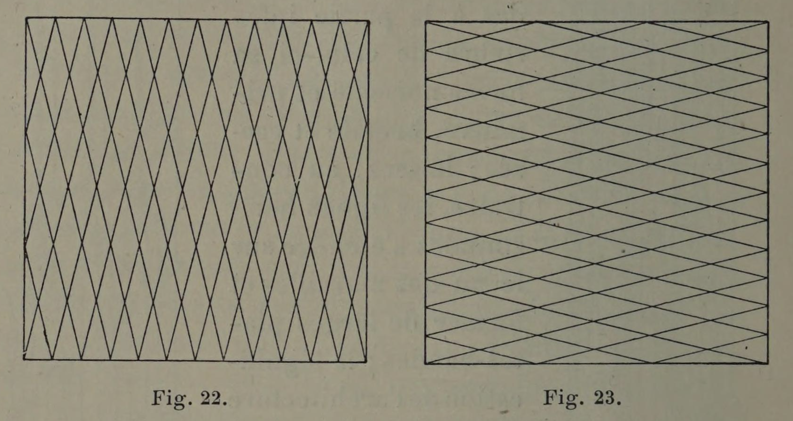

# Diagonals are hybrid lines.

## Original (French)

**XXIX. —— DIAGONALEMENT DISPOSÉES, LES LIGNES DROITES ONT AUSSI UNE SIGNIFICATION, ET, SUIVANT LA POSITION QU'ELLES OCCUPENT, PRODUISENT UNE IMPRESSION PARTICULIÈRE.**

On peut dire de la ligne diagonale qu’elle tient le milieu entre la ligne horizontale et la verticale, et que, suivant l'inclinaison qu’on lui donne, sa signification personnelle présente des analogies avec celle de ces deux lignes dont elle se rapproche le plus. Ainsi, à mesure qu’elle se redresse, elle tend à prendre les qualités poétiques de la ligne verticale; à mesure, au contraire, qu’elle s'incline, elle donne davantage l’impression de tranquillité et d’apaisement, qui est le propre de la ligne horizontale.

Les diagonales, en outre, conservent cette signification lorsqu'elles sont coupées par Le croisement d’autres lignes d’inclinaison égale. Ce croisement forme naturellement un certain nombre de losanges (voir fig. 22 et 23), et le caractère de ces losanges varie à son tour, suivant l’inclinaison plus ou moins marquée des lignes qui leur donnent naissance.

## Translation

**XXIX. — Straight lines arranged diagonally also have their own meaning, and, according to the position they occupy, produce a particular impression.**

One may say of the diagonal line that it stands midway between the horizontal and the vertical, and that, according to the inclination given to it, its personal meaning presents analogies with whichever of those two lines it most nearly approaches.

Thus, as it rises toward the vertical, it tends to take on the poetic qualities of the vertical line.

As, on the contrary, it inclines toward the horizontal, it gives more strongly the impression of tranquility and appeasement that belongs to the horizontal line.

Diagonals, moreover, retain this significance when they are crossed by other lines of equal inclination.

Such crossings naturally form a number of lozenges or diamonds (see figs. 22 and 23), and the character of these lozenges varies in turn according to the greater or lesser inclination of the lines from which they arise.

## Images

