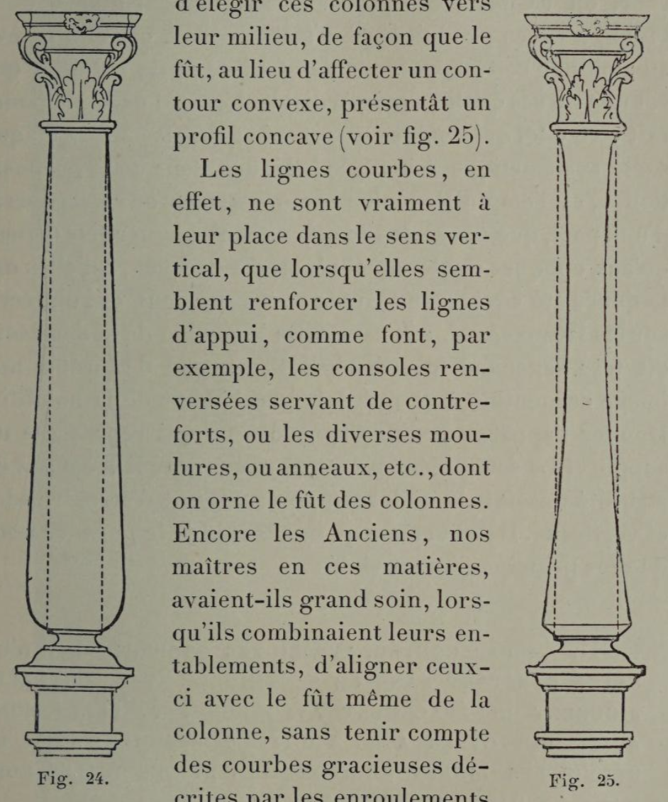

# If it bears weight, let it appear trustworthy.

## Original (French)

**XXXII. — LORSQU'UN ARTISTE COMPOSE UN PROJET D ÉDIFICE, OU LE DESSIN D'UN MEUBLE DONT LA BASE REPOSE DIRECTEMENT SUR LE SOL, IL NE DOIT EMPLOYER QU AVEC BEAUCOUP DE CIRCONSPECTION LES LIGNES COURBES DANS LE SENS VERTICAL.**

«Pour des raisons analogues à celles que nous venons d'exposer dans la précédente proposition, les décorateurs apportent généralement une certaine réserve dans l'emploi des lignes courbes disposées verticalement. Ces lignes, en effet, par suite de leur naturelle souplesse et de leur apparente flexibilité, semblent peu propres à supporter quelque chose de pesant. Or, dans la décoration aussi bien que dans l'architecture, les lignes verticales limitent presque toujours les masses portantes; et il semble indispensable que la force de résistance des supports et des appuis apparaisse d’une façon bien visible. Aussi les décorateurs et les architectes, lorsqu'ils veulent ajouter quelque grâce à leur dessin, et quand ils croient, pour cela, devoir recourir à l'usage de lignes courbes disposées verticalement, ont-ils soin de rejeter ces lignes courbes en dehors du nu de leur construction, ou tout au moins des perpendiculaires indiquant leurs aplombs. C’est ainsi, par exemple, que, trouvant les ordres classiques trop austères et voulant enlever à leurs colonnes une partie de leur rigidité, certains architectes anciens ont eu l'idée de tenir celles-ci « plus grosses vers le milieu et de les diminuer vers les deux extrémités, c'est-à-dire vers la base et vers le chapiteau, ce qui leur fait avoir comme un ventre qu’on appelle renflement1 » (voir fig. 24). Par contre, il ne leur serait jamais venu à l'esprit d'élégir ces colonnes vers leur milieu, de façon que le fût, au lieu d’affecter un contour convexe, présentât un profil concave (voir fig. 25).

Les lignes courbes, en effet, ne sont vraiment à leur place dans le sens vertical, que lorsqu'elles semblent renforcer les lignes d'appui, comme font, par exemple, les consoles renversées servant de contreforts, ou les diverses moulures, ou anneaux, etc., dont on orne le fût des colonnes. Encore les Anciens, nos maîtres en ces matières, avaient-ils grand soin, lorsqu'ils combinaient leurs entablements, d’aligner ceuxci avec le fût même de la colonne, sans tenir compte des courbes gracieuses décrites par les enroulements du chapiteau ionique, ou par les feuilles d'acanthe du chapiteau corinthien.

Dans la construction des meubles, les mêmes précautions sont à prendre. Les dessinateurs habiles, quand ils emploient des courbes dans le sens vertical, ont toujours soin de développer ces courbes en dehors de leurs lignes d’aplomb. Même au xviii° siècle, où l’on abusa des contours assouplis, où les pieds de biche firent en quelque sorte fureur, On respecta ces prescriptions fondamentales, dont l’inobservance produit le plus fâcheux effet, car elle enlève au mobilier cette apparence de stabilité et de solidité, qui est une de ses qualités primordiales. Un seul exemple pourrait être cité, qui semble contrevenir d’une façon en quelque sorte systématique, à la règle indiquée dans cette proposition. C’est l'emploi des colonnes torses; mais on remarquera, d’une part, que ces sortes de colonnes n'ont guère été usitées qu'aux époques de décadence2, et, d’autre part, qu’elles ont toujours été sévèrement condamnées par ceux qui ont écrit sur les Beaux-Arts. « N'est-ce pas le comble de la déraison, dit très sagement M. Charles Blanc, que de prêter une image serpentine à ce qui doit être l’image de la solidité? Donner l'apparence d’une spirale à ce qui représente un support! La seule idée en est effrayante, car il n’est pas de stabilité possible là où les supports cessent d’êtres rigides et verticaux. Il suffit même qu’ils cessent de le paraître pour que les principes soient violés ».

1 Perrault, Ordonnance des cinq espèces de colonnes selon la methode des anciens ; Paris, 1683, p. 20.

2 Il n'y a pas d'exemple de colonnes torses employées dans l’Antiquité classique. Les plus anciennes que l’on connaisse furent cédées par l’exarque de Ravenne Eutichius au pape Grégoire III. Elles ne remontent donc pas au delà du virr° siècle. Assez usitée dans la période romane ; moins souvent utilisée durant la période ogivale ; délaissée à l’époque de la Renaissance, la colonne torse réapparut au xvrr° siècle. Le cavalier Bernin s’en servit pour porter le baldaquin de Saint-Pierre de Rome. Gabriel Leduc lui donna accès au Val-de-Grâce, et Mansart aux Invalides ; mais, malgré ces exemples fameux, elle n'a jamais été en grand honneur.

## Translation

**XXXII. — When an artist designs a building, or a piece of furniture whose base rests directly on the floor, he should use vertically oriented curved lines only with great caution.**

For reasons similar to those set out in the previous proposition, decorators generally show restraint in the use of curved lines arranged vertically.

Such lines, by reason of their natural suppleness and apparent flexibility, seem ill-suited to support anything heavy.

Now, in decoration as in architecture, vertical lines almost always define the load-bearing masses; and it seems essential that the resisting strength of supports and points of bearing should appear clearly visible.

Thus decorators and architects, when they wish to add grace to a design, and believe they must therefore employ vertically disposed curves, take care to place those curves outside the main plane of the construction, or at least outside the perpendicular lines that indicate its true plumb.

Thus, for example, finding the classical orders too austere and wishing to remove some of the rigidity from their columns, certain ancient architects conceived the idea of making them “thicker toward the middle and slimmer toward the two extremities—that is, toward the base and the capital—thus giving them a sort of belly called an entasis”1 (see fig. 24).

By contrast, it would never have occurred to them to narrow those columns toward the middle, so that the shaft, instead of taking a convex contour, would present a concave profile (see fig. 25).

Curved lines, in fact, are truly in their place in the vertical direction only when they seem to reinforce lines of support—as do, for example, inverted consoles serving as buttresses, or the various moldings, rings, and the like used to ornament the shaft of a column.

Even so, the Ancients—our masters in such matters—took great care, when designing their entablatures, to align them with the shaft itself of the column, without taking account of the graceful curves described by the volutes of the Ionic capital or the acanthus leaves of the Corinthian capital.

In furniture construction, the same precautions are required.

Skilled designers, when they employ curves vertically, always take care to develop those curves outside their plumb lines.

Even in the eighteenth century, when softened contours were abused and cabriole legs were all the rage, these fundamental prescriptions were still respected, for violating them produces the most unfortunate effect: it deprives furniture of that appearance of stability and solidity which is one of its primary qualities.

Only one example might be cited that seems to violate, in an almost systematic way, the rule stated in this proposition: the use of twisted columns.

But one will note, first, that such columns were scarcely used except in periods of decadence;2 and second, that they were always severely condemned by writers on the Fine Arts.

“Is it not the height of unreason,” says M. Charles Blanc very sensibly, “to lend a serpentine image to that which ought to be the image of solidity? To give the appearance of a spiral to what represents a support! The mere idea is alarming, for no stability is possible where supports cease to be rigid and vertical. It is enough that they cease merely to appear so for principles to be violated.”

1 Perrault, _Ordinance of the Five Orders of Columns According to the Method of the Ancients_; Paris, 1683, p. 20.

2 There are no examples of twisted columns employed in Classical Antiquity. The oldest known examples were presented by Eutychius, the Exarch of Ravenna, to Pope Gregory III; they therefore date back no further than the 8th century. Fairly common during the Romanesque period, less frequently used during the Gothic period, and abandoned during the Renaissance, the twisted column reappeared in the 17th century. Cavalier Bernini employed it to support the baldachin at St. Peter's in Rome; Gabriel Leduc introduced it at Val-de-Grâce, and Mansart at Les Invalides. Yet, despite these celebrated examples, it never enjoyed widespread prestige.

## Images

