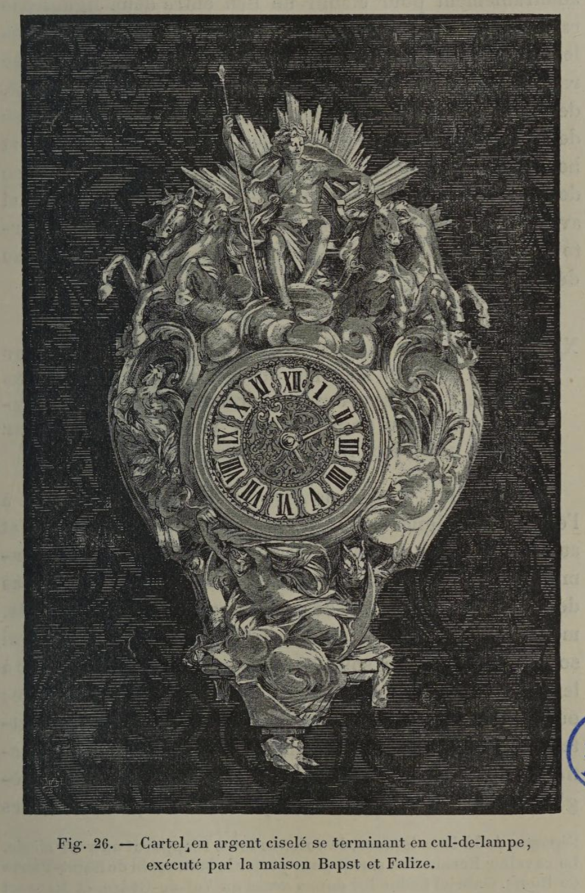

# Suspending objects don't need to look load-bearing.

## Original (French)

**XXXIV. -— S’AGIT-IL D'UN CARTOUCHE, D'UN CARTEL OU DE TOUT AUTRE MEUBLE SUSPENDU, LES CONDITIONS D'APLOMB ET DE SUPPORT SE TROUVANT CHANGÉES, L'EMPLOI DES LIGNES COURBES DANS LE SENS VERTICAL NE PRÉSENTE PLUS LES MÊMES INCONVÉNIENTS.**

Ce que nous venons de dire relativement au rôle et à l'emploi des lignes courbes ne s'applique qu'aux objets et aux surfaces qui, portant directement sur le sol, sont soumis à ce qu'on appelle l'équilibre de station. Il n’en va pas de même quand il s’agit de surfaces ou d'objets — cartels, médaillons, chutes, cartouches, tableaux, lampes, etc. — qui sont retenus en l'air, soit par un anneau ou un crochet fixé à leur partie supérieure, soit par quelque soutien invisible ; ou encore de ces balcons, tribunes, tourelles, échauguettes, etc., édifiés en encorbellement. Ces sortes de constructions , d'objets ou d’ornements sont soumis à d’autres règles. Ils obéissent aux lois de l'équilibre de suspension. Leurs lignes verticales cessent dès lors de délimiter les masses portantes ; et leurs contours inférieurs, ne devant jamais servir d'appui apparent, peuvent, sans inconvénient, s'inscrire dans une ligne courbe et affecter cette forme très caractéristique qui porte, dans les arts du dessin, le nom de cul-de-lampe (voir fig. 26).

## Translation

**XXXIV. — When dealing with a cartouche, a wall clock, or any other suspended object, the conditions of plumb and support being altered, the use of curved lines in the vertical direction no longer presents the same disadvantages.**

What we have just said regarding the role and use of curved lines applies only to objects and surfaces that rest directly on the ground and are subject to what is called standing equilibrium.

It is otherwise when dealing with surfaces or objects—wall clocks, medallions, pendant ornaments, cartouches, paintings, lamps, etc.—that are held aloft either by a ring or hook fixed at their upper part, by some invisible support, or again with balconies, galleries, turrets, watchtowers, and the like built in corbelling.

These kinds of constructions, objects, or ornaments are governed by different rules.

They obey the laws of suspended equilibrium.

Their vertical lines therefore cease to define load-bearing masses; and their lower contours, since they are never meant to serve as apparent supports, may without inconvenience be inscribed in a curved line and take on that very characteristic form which, in the graphic arts, bears the name cul-de-lampe (see fig. 26).

## Images

_Fig. 26. — Cartel clock in chased silver, terminating in a pendant finial, executed by the firm of Bapst et Falize._
