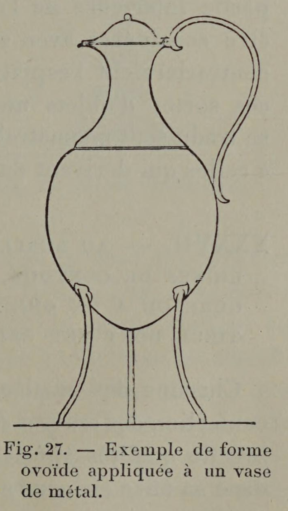

# Footed vessels may have a spherical underside.

## Original (French)

**XXXV. — LORSQU'UN OBJET EST MONTÉ SUR UN PIED, ET LORSQU'IL EST FORMÉ D'UNE SUBSTANCE HOMOGÈNE (MÉTAL, CÉRAMIQUE, MARBRE, ETC.), C EST-A-DIRE LORSQU'IL EST FAIT OU PARAÎT ÊTRE FAIT D'UN SEUL MORCEAU, SES CONTOURS INFÉRIEURS PEUVENT, SANS INCONVÉNIENT, RAPPELER LA FORME DE L'ŒUF OU DE LA SPHÈRE.**

Tout objet posé sur un pied peut être considéré comme suspendu sur ce pied, et ses contours inférieurs peuvent, en conséquence, affecter une silhouette curviligne. Cette silhouette même ne manquera pas de produire un effet satisfaisant si notre objet est exécuté en une matière ductile, tenace, résistante, et s’il paraît pris dans une même masse et formé d’un seul morceau. C’est en tenant compte des qualités de la matière dont ils sont fabriqués, que l'œil prend plaisir à contempler les beaux vases de marbre, de faïence, de porcelaine, ainsi que ces pièces d’orfèvrerie, aiguières, coupes, saucières, etc., dont la partie inférieure dérive, comme forme, de l’œuf ou de la sphère.

## Translation

**XXXV. — When an object is mounted on a foot, and when it is made of a homogeneous substance (metal, ceramic, marble, etc.)—that is to say, when it is made, or appears to be made, of a single piece—its lower contours may, without inconvenience, recall the form of the egg or the sphere.**

Any object set upon a foot may be considered as suspended upon that foot, and its lower contours may consequently take on a curvilinear silhouette.

That very silhouette will produce a pleasing effect if the object is made in a material that is ductile, tenacious, and resistant, and if it appears to be taken from one mass and formed of a single piece.

It is by taking account of the qualities of the material from which they are made that the eye takes pleasure in contemplating fine vases of marble, faience, or porcelain, as well as pieces of goldsmith’s work—ewer, cups, sauceboats, and the like—whose lower part derives its form from the egg or the sphere.

## Images

_Fig. 27. — Example of an ovoid form applied to a metal vase._
