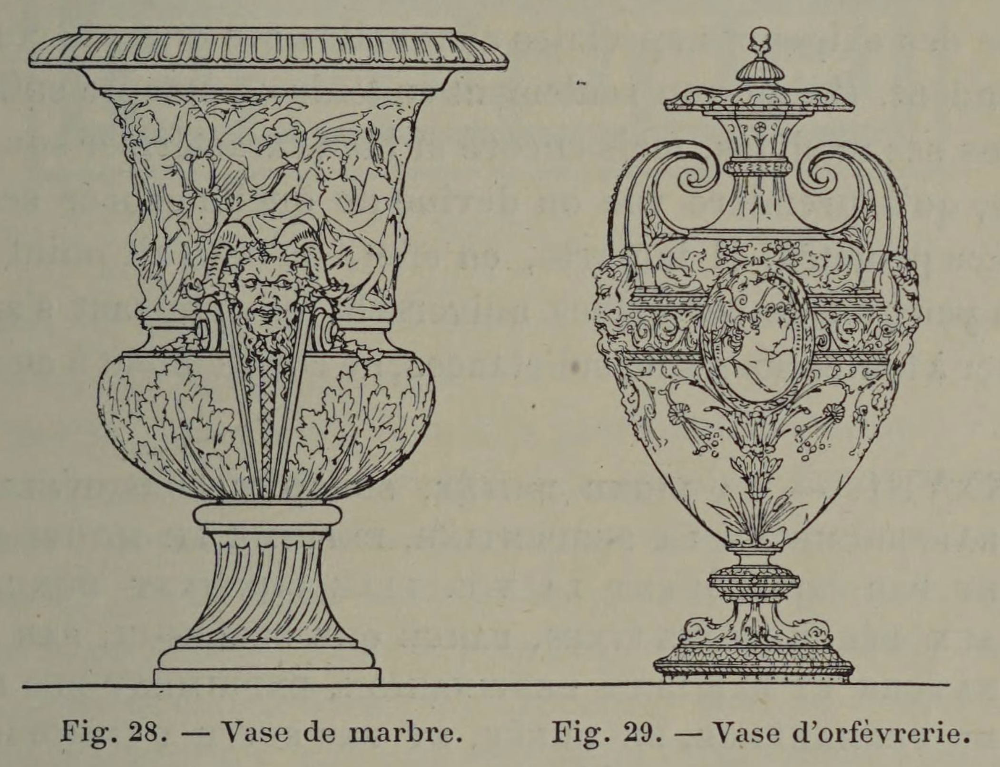

# Form Should Express Material

## Original (French)

**XXXVII. — au suRPLUS ET D'UNE FAÇON GÉNÉRALE, LES LIGNES DE CONTOUR, QUI DONNENT L'APLOMB À UNE FIGURE OU A UN OBJET, DOIVENT VARIER SUIVANT LA MATIÈRE DONT CET OBJET EST FABRIQUÉ.**

Chacune des matières employées couramment dans la confection des œuvres décoratives, possède un certain nombre de qualités spéciales et, comme corollaire, présente dans sa mise en œuvre des difficultés de traitement et des exigences de nature particulière, dont le décorateur est forcé de tenir compte. Il est clair qu’un artiste auquel on commande un modèle de vase, doit se préoccuper tout d’abord de la matière dans laquelle ce vase sera confectionné, et suivant qu’on lui demandera de le faire en céramique, en marbre ou en métal, il lui faudra proportionner les dimensions du pied, la largeur de l’embase, l’importance des points d'appui, le relief des contours, la finesse des profils, à la malléabilité, à la densité, à la résistance de la substance employée. Le galbe lui-même changera suivant la matière. (Voir fig. 28 et 29.) Ne serait-il pas malséant, par exemple, de doter d’un goulot allongé un vase qui doit être exécuté en granit ou en porphyre. Bien mieux, sans sortir de la céramique, n’importe-t-il pas ‘de savoir si c’est en porcelaine ou simplement en faïence que le vase commandé doit être façonné ? La seconde de ces pâtes, en effet, se modèle avec un gras, une ampleur assouplie, que ne possède point la première, beaucoup plus ferme en ses contours, souvent même un peu sèche. La porcelaine, d'autre part, présente un précieux, un éclat, une netteté de profils, une délicatesse de coloration que la poterie ordinaire ne four\_ nira Jamais. De même le bronze et l'argent, qui, par suite de l'inégalité de valeur, sont traités de façons différentes, réclament aussi des contours différents. Enfin, il n’est pas jusqu’à la pierre et au marbre, — pour ne parler que de matériaux souvent confondus, — qui n’exigent des formes en rapport avec le grain, la résistance et la ténacité qui leur sont propres.

Le devoir du dessinateur lorsqu'il combine une forme, est done de se pénétrer avant tout des diverses qualités qui distinguent la matière destinée à être employée, amsi que des exigences spéciales auxquelles ces qualités correspondent. Il doit non seulement en tenir un compte suffisant dans ses modèles, mais encore si bien caractériser son dessin, qu'à première vue on devine de quelle espèce sera la pièce projetée. Il importe, en effet, qu'on n'ait point sous les yeux un de ces galbes universels qui, pouvant s’appliquer à toutes sortes de substances, ne conviennent à aucune.

## Translation

**XXXVII. — Moreover, and in a general way, the contour lines that give a figure or object its visual stability must vary according to the material from which that object is made.**

Each material commonly used in the decorative arts possesses certain special qualities and, as a consequence, presents particular technical difficulties and requirements that the decorator is obliged to take into account.

It is obvious that an artist commissioned to design a vase must first concern himself with the material in which the vase will be made. Depending on whether it is to be executed in ceramic, marble, or metal, he must proportion the size of the foot, the width of the base, the importance of the points of support, the relief of the contours, and the delicacy of the profiles to the malleability, density, and resistance of the substance employed.

The profile itself will vary according to the material (see fig. 28 and 29).

Would it not be improper, for example, to give a long, slender neck to a vase intended to be executed in granite or porphyry?

More than that—even within ceramics—it matters greatly whether the commissioned vase is to be made in porcelain or simply in faience.

The latter material is modeled with a softness and generous suppleness that the former does not possess. Porcelain, by contrast, is firmer in contour, sometimes even a little dry.

On the other hand, porcelain offers a preciousness, brilliance, sharpness of profile, and delicacy of color that ordinary pottery can never provide.

Likewise bronze and silver, which are treated differently because of their unequal value, also require different contours.

Finally, even stone and marble—to speak only of materials often confused with one another—demand forms corresponding to their own grain, strength, and toughness.

The duty of the designer, when composing a form, is therefore above all to steep himself in the distinct qualities of the intended material, as well as the special demands that arise from those qualities.

He must not only take them properly into account in his designs, but characterize the form so clearly that, at first glance, one can guess the nature of the material from which the object is to be made.

For it is important not to place before the eye one of those universal profiles which, being applicable to every substance, are truly suited to none.

## Images

_Fig. 28. — Marble vase. Fig. 29. — Goldsmith's vase._
