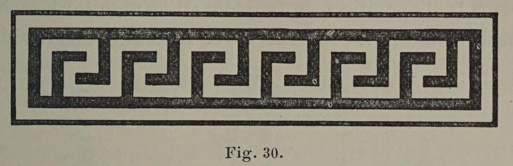

# Movement belongs on ornament, not structure

## Original (French)

**XXXVIII. —— LA LIGNE BRISÉE, SURTOUT LORSQU'ELLE SE RAPPROCHE DE LA SERPENTINE, EXPRIME LE MOUVEMENT, ET PAR CONSÉQUENT LA VIE. ELLE CONVIENT DONC PEU AUX DÉCORATIONS FIXES, PARCE QUE CELLES-CI, PAR LEUR NATURE ET PAR LEUR DESTINATION, EXPRIMENT DES IDÉES DE PERMANENCE, DE DURÉE, ET PAR SUITE D IMMOBILITÉ. AUSSI NE DOIT-ON L'EMPLOYER QU'AVEC UNE CERTAINE CIRCONSPECTION ET EN ACCENTUANT, PAR UNE RÉPÉTITION SYMÉTRIQUE, SON CARACTÈRE DÉCORATIF, OU ENCORE EN AYANT SOIN DE L'ISOLER PAR UN ENCADREMENT.**

Après avoir déterminé le rôle joué dans la décoration par les lignes droites et courbes, l'impression qu’elles produisent et la signification qu’elles comportent, il nous reste à dire quelques mots de la ligne brisée. Nous avons constaté que cette dernière, par sa constitution même, répondait à des idées de mouvement et d’agitation; dès lors il semble qu’elle soit assez mal venue à figurer dans une décoration fixe, condamnée par sa nature même à une immobilité permanente. Il est bien évident, par exemple, qu’un lambris, une corniche, une cheminée, qui font corps en quelque sorte avec la muraille, doivent présenter une continuité de surface, une apparence de stabilité et donner une impression de solidité, que la contemplation des lignes brisées ne saurait produire. Celles-ci, par les angles dont elles se hérissent, ne répondent, en effet, à aucune de ces idées. Aussi, dans le dessin des lambris, des corniches, des cheminées et même de la plupart des meubles, le dessinateur, de préférence, se sert-il exclusivement de lignes droites et de lignes courbes.

L'usage, cependant, depuis la plus haute antiquité, a autorisé et même consacré l'emploi de certaines lignes brisées dans la décoration des bandeaux, des frises, etc. Ceslignes, devenues en quelque sorte classiques, et qu’on désigne d’une façon générale sous le nom de grecques, de postes, etc., sont ordinairement d’un effet agréable. Mais le décorateur a soin d’accentuer, par une répétition étroitement symétrique, leur rôle purement ornemental; et le plus souvent, en les isolant par un encadrement il s’effrce de bien signifier qu'elles ne font point corps avec la masse de l’ouvrage, et qu'elles constituent un ornement simplement superposé.

## Translation

**XXXVIII. — Broken lines, especially when they approach the serpentine form, express movement and therefore life. They are consequently ill-suited to fixed decoration, because such decoration, by its nature and purpose, expresses ideas of permanence, duration, and therefore immobility. Thus they should only be used with a certain caution—either by emphasizing their decorative character through symmetrical repetition, or by isolating them within a frame.**

After determining the role played in decoration by straight and curved lines, the impressions they produce, and the meanings they convey, it remains for us to say a few words about the broken line.

We have observed that, by its very constitution, the broken line corresponds to ideas of movement and agitation. It therefore seems somewhat out of place in fixed decoration, which by its very nature is condemned to permanent immobility.

It is quite evident, for example, that paneling, a cornice, or a fireplace—which in a sense form one body with the wall—must present a continuity of surface, an appearance of stability, and give an impression of solidity that broken lines are incapable of producing.

Indeed, because of the angles with which they bristle, such lines correspond to none of those ideas.

Thus, in the design of paneling, cornices, fireplaces, and even most furniture, the designer generally employs almost exclusively straight and curved lines.

Usage, however, since the highest antiquity, has authorized and even consecrated the use of certain broken lines in the decoration of bands, friezes, and the like.

These lines, which have become in a sense classical and are generally known as Greek key patterns, fretwork, and similar motifs, ordinarily produce a pleasing effect.

But the decorator takes care to emphasize their purely ornamental role through tightly ordered symmetrical repetition; and most often, by isolating them within a border or frame, he strives to make clear that they do not form part of the mass of the work itself, but constitute merely a superimposed ornament.

## Images

_Fig. 30._
