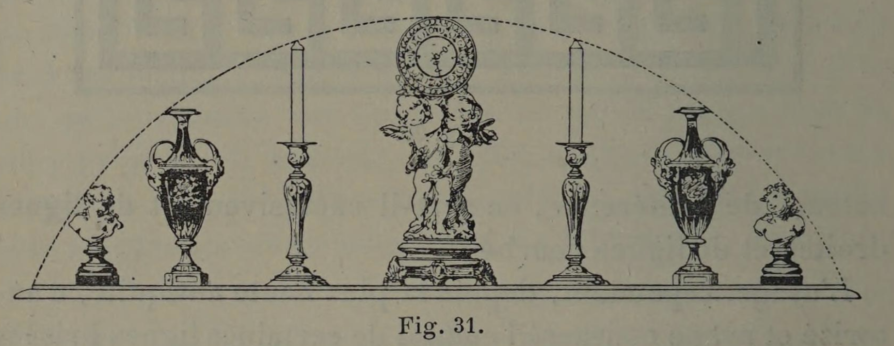
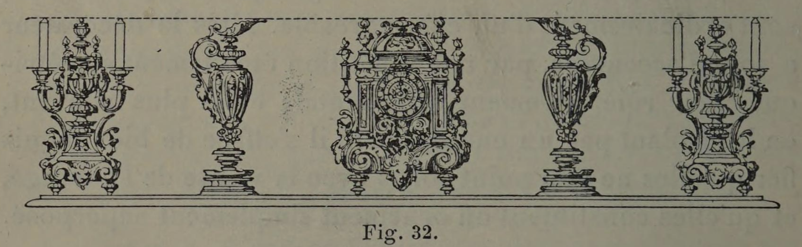

# Architecture needs stability; Objects need rhythm

## Original (French)

**XXXIX. —— PAR CONTRE, LA LIGNE BRISÉE JOUE UN RÔLE IMPORTANT DANS LA DÉCORATION MOBILE. ELLE S'IMPOSE MÊME LORSQUE CETTE DÉCORATION RÉSULTE D'UN GROUPEMENT D'ŒUVRES SÉPARÉES OU D'OBJETS INDÉPENDANTS L'UN DE L'AUTRE.**

Dans la disposition de la décoration mobile, les choses se passent d’une façon différente. Autantil serait ridicule de briser, à l’aide de bossages, la tablette supérieure d’une cheminée et de lui donner l’onduleuse apparence d’une mer agitée par la tempête, autant il serait maladroit d’établir un niveau régulier entre les divers objets qui décorent cette tablette, de façon que ces sommets s'inscrivent dans un arc de cercle ou forment une ligne droite parallèle à leur ligne de base (voir fig. 31 et 32). Une pareille régularité enlèverait tout caractère à la décoration; elle contrarierait l'esprit et blesserait les regards.

De même, lorsque l’on décore une pièce en suspendant à la muraille des armes, des faïences, des tableaux, il faut se

garder, si le hasard veut que ces objets soient de même taille, de les disposer sur des lignesparallèles, correspondant aux principales divisions horizontales de la décoration.

Du moment qu’un certain nombre d'objets sont posés sur une paroi sans faire corps avec elle, il importe que leur caractère de mobilité soit clairement indiqué, accentué même par l’irrégularité des lignes décoratives que forment leurs contours extérieurs. Toutefois, si un seul plat, une statuette unique, ou un tableau se trouve accroché au milieu d’un panneau, il pourra se raccorder avec un autre objet de même nature, également isolé, placé sur un autre panneau, à la même hauteur, et de façon à lui faire pendant. Cela vient de ce que, dans ce nouveau cas, la ligne décorative se trouve interrompue, et que les deux objets ainsi séparés forment une équivalence symétrique, et non plus un ensemble.

## Translation

## Images

_Fig. 31._

_Fig. 32._
