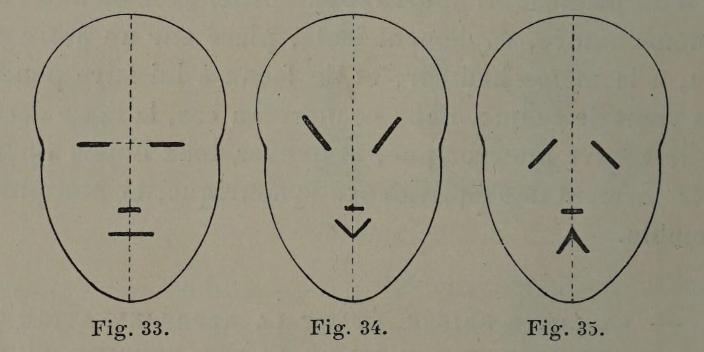
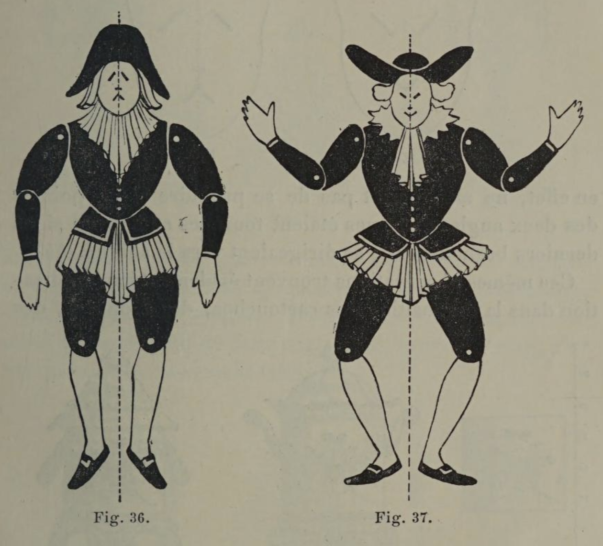
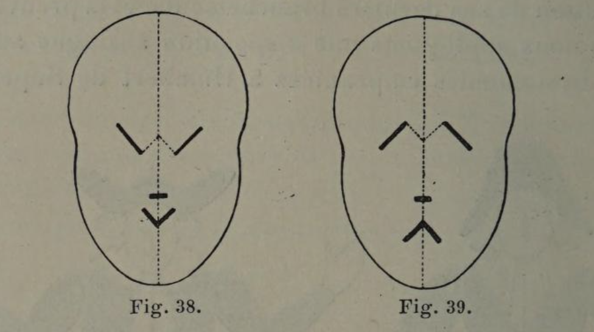
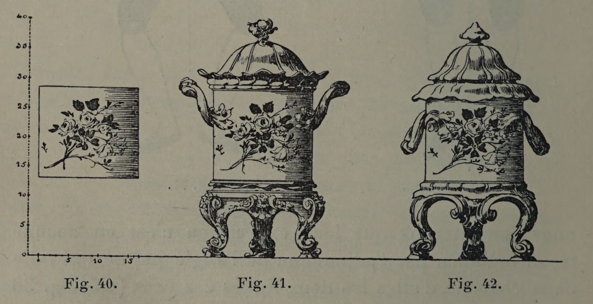
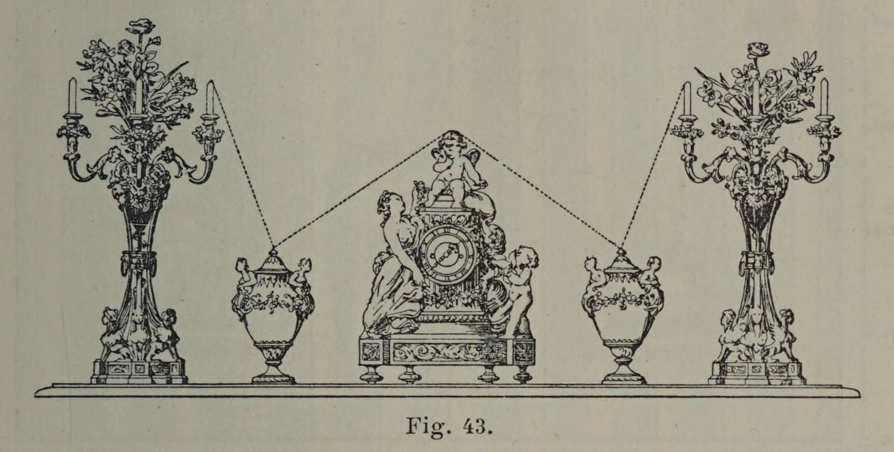
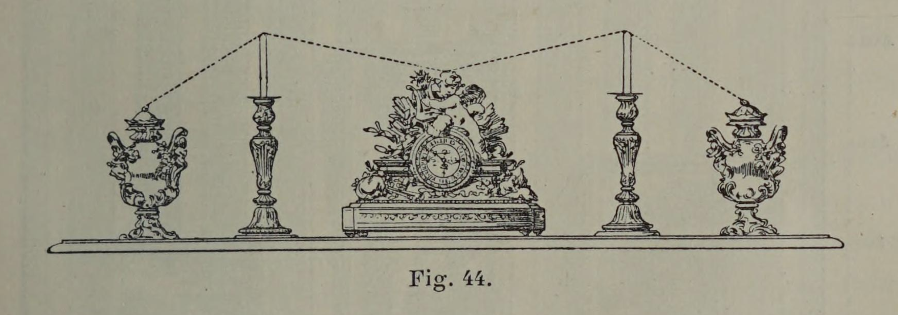

# Upward gestures excite; Downward gestures sadden.

## Original (French)

**XL. — LA LIGNE BRISÉE, ÉTANT LA REPRÉSENTATION GRAPHIQUE DU MOUVEMENT ET DE LA VIE, EXPRIME, SUIVANT LA DISPOSITION QU ELLE AFFECTE, DES IDÉES DE TRISTESSE OU DE GAIETÉ.**

Humbert de Superville, dans un ouvrage peu connu et rempli cependant de vues ingénieuses1, démontre, à l’aide des trois figures ci-contre, qu'il suffit d’un certain déplacement des lignes fondamentales du visage humain, pour faire signifier à celui-ci des sentiments non seulement différents, mais radicalement contradictoires. Lorsque ces lignes sont horizontales (fig. 33) la physionomie exprime un repos parfait. Se relèvent-elles de façon à former un angle aigu dont la pointe est dirigée vers le sol, la physionomie (fig. 34) exprime une certaine gaieté. Lorsque l'angle dresse, au contraire, sa pointe en l’air (fig. 35) les traits prennent un accent de désolation fort remarquable. La constatation faite par Humbert de Superville est-elle absolument nouvelle ? Assurément non. Mais au mérite d’être amusante elle joint l'avantage de préciser et de rendre saisissante une remarque que tout le monde a pu faire, sans en bien saisir l’intérêt et la portée.

Déjà, dans un précédent paragraphe (XXXe proposition) nous nous sommes préoccupé de l’impression produite par la contemplation des divers angles formés par la rencontre de deux diagonales; ici la démonstration est sensiblement différente, car la ligne brisée symétrique n’emprunte pas, comme dans la proposition antérieure, sa valeur sentimentale à l’acuité plus ou moins grande de son angle central, mais, au contraire, à l'inclinaison plus ou moins accentuée des branchements qui s’éloignent le plus de cet angle. Pour le démontrer, élargissons le cadre de notre observation, et prenons sinon un homme, du moins un pantin, et au lieu de mouvementer seulement son visage, agitons encore ses bras. Grâce au double mouvement que présentent nos figures 36 et 37, nous obtiendrons des deux côtés de nos petits bonshommes des angles nouveaux qui conserveront à l'un d’eux son aspect désolé, et achèveront de donner à l’autre un air de contentement indiscutable. Dans chacune de ces figures, cependant, l'angle central est différent de celui qui donnait un caractère si frappant à notre démonstration précédente. On peut donc en déduire que la sigmification sentimentale d’une ligne brisée résulte exclusivement de la disposition de ses derniers branchements, et la preuve c’est que si nous appliquons une disposition analogue aux petites physionomies empruntées à Humbert de Superville, nous constaterons que leur expression n’est en aucune façon modifiée par l’adjonction de l'angle pointé qui relie dans chacune d'elles les deux lignes des yeux (voir fig. 38 et 39).

Que conclure de là, car toutes nos observations tendent à des résultats pratiques ? On en doit conclure que le décorateur chargé de mettre en place une garniture de cheminée, ou de grouper les divers objets destinés à décorer la tablette d’une console ou d’un meuble, s’il veut donner un air de gaieté à cette réunion d'objets, doit les disposer de façon que les branchements extrêmes de la ligne brisée formée par eux se redressent (fig. 43). L’impression contraire, en effet, ne manquerait pas de se produire si les pointes des deux angles extrêmes étaient tournées en l’air, et si les derniers branchements se dirigeaient vers le sol (fig. 44). Ces mêmes observations trouvent également leur application dans la disposition des cartouches, des trophées,' des attributs, auxquels on peut communiquer, suivant qu’on le désire, un aspect gai ou lamentable. De même, par un décor. surajouté, on arrive à donner à un objet de forme régulière et qui, par conséquent, n’a pas de caractère décidé (fig. 40), une apparence Joyeuse ou morose (fig. 41 et 42). On peut pareillement, en tenant compte de ces remarques, atténuer le côté sévère de certaines lignes. Le ressaut qui marquele départ d’une rampe enlève à celle-ci un peu de la tristesse que présentent ses lignes parallèles se dirigeant vers le sol.

Les acrotères placés aux extrémités des frontons romains en corrigent l’austérité et ajoutent quelque gaieté à la façade. Cent exemplés, au surplus, seraient à citer de l’emploi pour ainsi dire instinctif de cette règle, qui, croyons-nous, n’avait jamais été clairement formulée.

1 Les Signes inconditionnels de l’art.

## Translation

**XL. — The broken line, being the graphic representation of movement and life, expresses—according to the arrangement it takes on—ideas either of sadness or of gaiety.**

Humbert de Superville, in a little-known work nevertheless full of ingenious ideas1, demonstrates through the three accompanying figures that it takes only a slight displacement of the fundamental lines of the human face to make it express sentiments not merely different, but radically contradictory.

When these lines are horizontal (fig. 33), the expression conveys perfect repose.

If they rise so as to form an acute angle whose point is directed toward the ground, the face (fig. 34) expresses a certain gaiety.

If, on the contrary, the angle raises its point upward (fig. 35), the features take on a striking accent of desolation.

Is Humbert de Superville’s observation entirely new? Certainly not. But beyond the merit of being amusing, it has the advantage of clarifying and vividly illustrating a fact everyone may have observed without fully grasping either its significance or its implications.

Already, in a previous paragraph (Proposition XXX), we concerned ourselves with the impression produced by contemplating the various angles formed by the meeting of two diagonals.

Here, however, the demonstration is notably different, because the symmetrical broken line derives its emotional value not, as in the previous proposition, from the greater or lesser sharpness of its central angle, but rather from the more or less pronounced inclination of the branches furthest removed from that angle.

To demonstrate this, let us broaden the scope of our observation and take—not a man perhaps—but at least a puppet; and instead of altering only the face, let us also move the arms.

Through the double movement shown in figures 36 and 37, we obtain on both sides of our little figures new angles that preserve in one its desolate appearance and complete in the other an unmistakable air of contentment.

Yet in each of these figures, the central angle differs from the one that gave such striking character to our previous demonstration.

We may therefore conclude that the emotional significance of a broken line results exclusively from the disposition of its outermost branches.

And the proof is that if we apply a similar arrangement to the small faces borrowed from Humbert de Superville, we find that their expression is in no way altered by the addition of the pointed angle joining the two lines of the eyes in each figure (see figs. 38 and 39).

What conclusion should we draw from this? For all our observations aim toward practical results.

We must conclude that the decorator charged with arranging a fireplace garniture, or grouping together the various objects intended to decorate the shelf of a console or cabinet, if he wishes to give this arrangement an air of gaiety, should dispose the objects so that the outer branches of the broken line formed by them rise upward (fig. 43).

The opposite impression would inevitably result if the points of the two outer angles were turned upward and the final branches descended toward the ground (fig. 44).

These same observations also apply to the arrangement of cartouches, trophies, and symbolic attributes, to which one may give, according to desire, either a cheerful or mournful aspect.

Likewise, by means of added decoration, one may give to an object of regular form—which therefore possesses no decided character in itself (fig. 40)—either a joyful or gloomy appearance (figs. 41 and 42).

One may similarly, by taking account of these observations, soften the severity of certain lines.

The slight projection marking the beginning of a staircase ramp removes some of the sadness presented by its parallel lines descending toward the ground.

The acroteria placed at the extremities of Roman pediments correct their austerity and add a certain gaiety to the façade.

A hundred examples, moreover, could be cited of the almost instinctive use of this rule, which, we believe, had never before been clearly formulated.

1 The Unconditional Signs of Art

## Images

_Fig 33., Fig 34., Fig. 35._

_Fig 36., Fig 37._

_Fig 38., Fig 39._

_Fig 40., Fig 41., Fig. 42_

_Fig 43._

_Fig 44._
