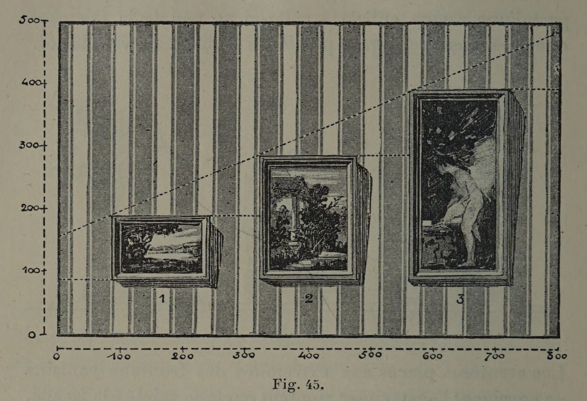
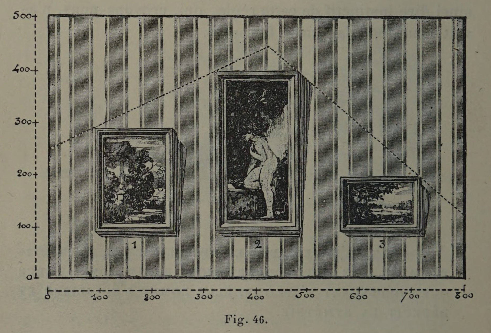
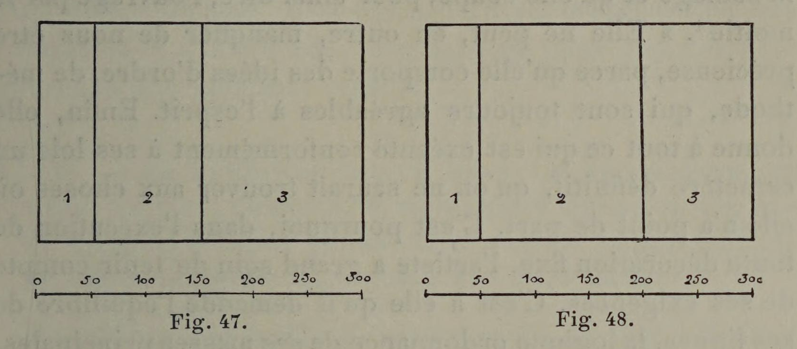

# Avoid "Stair-Step" Compositions

## Original (French)

**XLI. — DANS L'EMPLOI DES LIGNES BRISÉES IL FAUT ÉVITER AVEC SOIN TOUTE PROGRESSION ARITHMÉTIQUE, PARCE QUE, DÉPLAÇANT L'APLOMB, ELLE ROMPT L'ÉQUILIBRE ET DÉTRUIT LA SYMÉTRIE.**

Supposons que nous ayons trois tableaux de largeur égale, mais de hauteurs différentes, et que nous nous proposions de loger ces trois tableaux dans un même panneau. Supposons encore que notre premier tableau mesure 0",33 de hauteur, notre second tableau 0,66, et que notre troisième tableau compte 0%,99, — ce qui constitue une progression arithmétique. — Comment disposerons-nous ces trois tableaux ? Nous éviterons avec soin de les placer dans un ordre progressif : 1° parce que, de la sorte, la ligne brisée formée par les sommets de nos cadres pourrait se résumer dans une ligne droite, et qu’elle abdiquerait ainsi une grande partie de ses qualités vitales d'animation; 2° parce que, formant une sorte d'escalier, cette ligne brisée ferait perdre tout aplomb à notre décoration (voir fig. 45). Tandis que si nous employons une autre disposition (voir fig. 46), notre ligne reprend ses qualités expressives, et la décoration retrouve un équilibre qu’elle avait perdu.

Cette remarque s'applique également aux surfaces verticales qu'on peut avoir à décorer. On nous donne un panneau à diviser en trois parties, répondant comme largeur à la progression arithmétique 1, 2, 3. Respecterons-nous l’ordre de cette progression ? En aucune manière. Nous aurons, au contraire, grand soin de le rompre, pour que la décoration de notre panneau présente une sorte de symétrie relative (voir fig. 47 et 48).

## Translation

**XLI. — In the use of broken lines, one must carefully avoid all arithmetic progression, because by displacing the sense of vertical balance, it destroys equilibrium and symmetry.**

Suppose we have three paintings of equal width but different heights, and that we intend to place these three paintings within the same wall panel.

Suppose further that the first painting measures 0.33 meters in height, the second 0.66, and the third 0.99 — which constitutes an arithmetic progression.

How should we arrange these three paintings?

We should carefully avoid placing them in progressive order:

1. because, arranged in this way, the broken line formed by the tops of the frames could essentially be reduced to a straight line, thereby surrendering much of its lively, animated character;
2. because, forming a sort of staircase, this broken line would deprive the composition of all sense of upright balance (see fig. 45).

Whereas, if we adopt another arrangement (see fig. 46), the line recovers its expressive qualities, and the decoration regains an equilibrium it had lost.

This observation also applies to vertical surfaces that one may need to decorate.

Suppose we are given a panel to divide into three parts whose widths follow the arithmetic progression 1, 2, 3.

Should we preserve that progression in order?

Not at all.

On the contrary, we should take great care to interrupt it, so that the decoration of the panel presents a kind of relative symmetry (see figs. 47 and 48).

## Images

_Fig. 45._

_Fig. 46._

_Fig. 47., Fig. 48._
