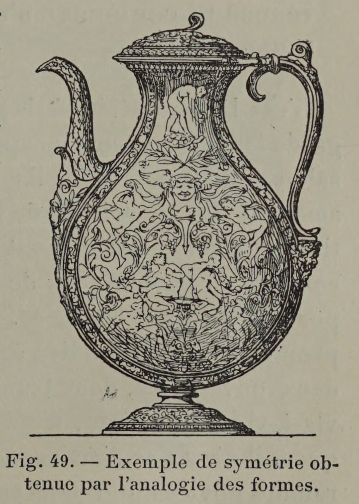

# Symmetry only matters side-to-side

## Original (French)

**XLIII. — LES RÈGLES PRESCRITES PAR LA SYMÉTRIE S'IMPOSENT UNIQUEMENT DANS LE SENS DE LA LARGEUR, ET NON DANS CELUI DE LA HAUTEUR.**

Ainsi que le remarque Pascal1, notre œil, s'inspirant des exemples que lui fournit le corps humain, — lequel est symétrique seulement dans le sens de la largeur, — ne considère pas comme indispensable la symétrie dans le sens de la hauteur. Pour la bonne disposition de son ornementation et la convenable répartition de ses masses, l'artiste a donc à se préoccuper exclusivement d’équilibrer sa composition en largeur. Il la concevra similaire à droite et à gauche de sa partie centrale, dissemblable en haut et en bas. De cette façon elle gagnera en imprévu; elle sera régulière sans être uniforme. Elle présentera en même temps des contrastes et des accords, et possédera dans une unité rigoureuse une suffisante variété.

1 Pensées, XXV, 77 (édit. Havet).

## Translation

**XLIII. — The rules imposed by symmetry apply only in the direction of width, and not in that of height.**

As Pascal observes1, our eye takes its cue from the human body, which is symmetrical only across its width, not along its height. Because of this, the eye does not consider vertical symmetry to be necessary.

In arranging ornament and distributing masses properly, the artist therefore needs to concern himself only with balancing the composition horizontally. He should design it so that the right and left sides correspond around a central axis, while allowing the upper and lower portions to differ.

In this way, the composition gains variety and surprise. It remains orderly without becoming monotonous. It presents both contrasts and harmonies, and achieves sufficient variety within a rigorous unity.

1 Thoughts, XXV, 77 (Havet edition).

## Images

_Fig. 49. — Example of symmetry obtained through the analogy of forms._
