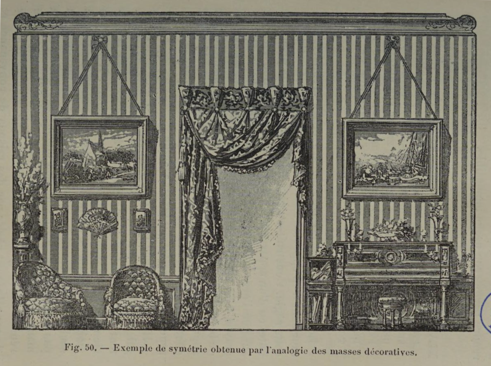

# Balance Matters More Than Perfect Symmetry

## Original (French)

**XLIV. —— LA SYMÉTRIE EXISTE DANS LA DÉCORATION ET DANS L'AMEUBLEMENT NON SEULEMENT QUAND IL Y À PARITÉ, MAIS ENCORE QUAND LES MASSES S'ÉQUILIBRENT, ET MÊME LORSQUE L'ANALOGIE EST SUFFISANTE.**

L'équilibre que la décoration est tenue de chercher dans le sens de la largeur ne s’obtient pas seulement — comme cela a lieu dans le corps humain — par «le rapprochement et la Juste correspondance de deux parties semblables quoique inversement disposées1. » Il s’obtient encore par de simples analogies. Ainsi deux tableaux représentant des sujets divers et comportant des dimensions différentes peuvent se faire pendant, c'est-à-dire qu'ils peuvent concourir à la symétrie d'une décoration, parce qu'il existe entre eux une analogie naturelle. De même une plaque de faïence de tonalité claire peut être considérée comme symétrique d’une aquarelle de même taille, parce qu'il ya entre leurs masses analogie de grandeur et de coloration (voir fig. 50). Ainsi de suite. Si de la décoration des surfaces murales nous passons à celle des objets mobiliers, nous trouvons à ces mêmes petits problèmes des solutions identiques. Supposons qu'un artiste soit chargé de composer, de dessiner un modèle de cafetière; pour que la symétrie soit irréprochable il faudrait qu'il gratifiât sa cafetière de deux anses et de deux becs. Cependant il n’a garde de le faire, et il se borne à équilibrer, dans la mesure du possible, ces deux membres différents, de façon à créer entre eux une analogie suffisante, constituant une sorte de symétrie.

1 Levêque, Science du beau, tome II, p. 340.

## Translation

**XLIV. — Symmetry exists in decoration and furnishing not only when there is equality, but also when the masses are balanced, and even when analogy alone is sufficient.**

The balance that decoration seeks across the width of a composition is not achieved only — as in the human body — through “the correspondence and proper relation of two similar parts arranged in reverse.”1

It can also be achieved through simple analogies.

Thus, two paintings depicting different subjects and having different dimensions can still function as pendants — that is, they can contribute to the symmetry of a decorative scheme — because a natural analogy exists between them.

Likewise, a ceramic plaque of light tonality may be considered symmetrical to a watercolor of similar size, because there is an analogy between their masses in both scale and color (see fig. 50).

And so on.

If we move from wall decoration to furniture and movable objects, we encounter the same kinds of problems and the same kinds of solutions.

Suppose an artist is asked to design a coffee pot. Strict symmetry would require giving it two handles and two spouts. Yet no sensible designer would do this. Instead, he simply balances these two different elements as well as possible, creating between them a sufficient analogy that produces a kind of symmetry.

1 Levêque, _Science of the Beautiful_, Vol. II, p. 340.

## Images

_Fig. 49. — Example of symmetry achieved through the analogy of forms._

_Fig. 50. — Example of symmetry obtained through the analogy of decorative masses._
