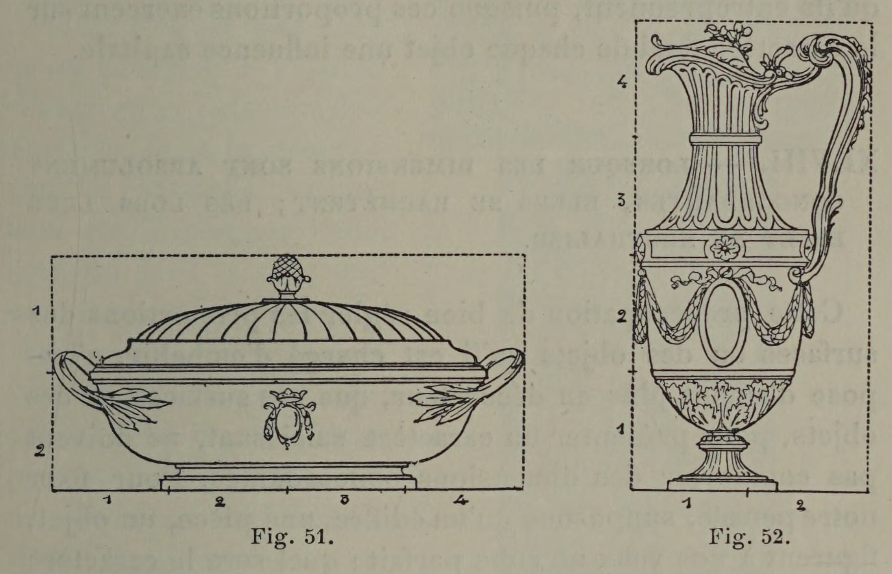

# Width Feels Stable, Height Feels Spiritual, Depth Feels Mysterious

## Original (French)

**XLVII. —— IL EST A REMARQUER QUE CHACUNE DES TROIS DIMENSIONS RÉPOND A DES SENTIMENTS PARTICULIERS LA LARGEUR EXPRIME L'IDÉE DE STABILITÉ ; LA HAUTEUR, CELLE D'ÉLÉVATION ; LA PROFONDEUR, CELLE DE MYSTÈRE.**

Les dimensions se traduisant graphiquement par des lignes, il n’est pas surprenant qu’elles aient, comme les lignes elles-mêmes, une signification précise (voir propositions XXV et suiv.). Selon qu’une des dimensions prime les autres, les lignes chargées d'exprimer cette dimension prennent, en effet, un développement plus considérable et, par suite, leur expression particulière augmente d'intensité. Un exemple rendra la démonstration plus saisissante. Supposons que nous ayons à édifier un monument religieux, une église ogivale, la Sainte - Chapelle, si l’on veut. Nous voici à l’œuvre. À mesure que notre construction s'élève, les lignes verticales, intérieurement aussi bien qu’extérieurement, prennent une importance de plus en plus marquée ; par conséquent l'impression qu’elles produisent s’accroît progressivement, jusqu'à prédominer complètement, et à assigner à notre édifice ce caractère de majesté, de poésie, d'élévation, qui est le propre des lignes verticales et qui, du reste, convient merveilleusement à une construction religieuse. Supposons, au contraire, que nous soyons chargés de bâtir un édifice civil, la Monnaie, par exemple. C’est en largeur que le développement de notre construction se manifestera. Les lignes horizontales deviendront de plus en plus expressives, et alors les idées de solidité, de stabilité, prendront le dessus, répondant aux sentiments de durée et de confiance que doit inspirer un monument de ce genre. Enfin la profondeur intérieure s’accentue-t-elle d’une façon particulière à mesure que les surfaces limitant l'horizon s’éloignent, elles deviennent moins visibles, plus incertaines, par conséquent plus mystérieuses. Une relative obscurité vient rendre plus intenses encore les sensations qu'on éprouve. « La nuit, écrit Diderot1, dérobe les formes, donne de l'horreur aux bruits; ne fùt-ce que celui d’une feuille au fond d’une forêt, il met l'imagination en Jeu, et l’imagination secoue les entrailles. »

Cette dernière impression, dont les Égyptiens ont tiré un si prodigieux parti dans la disposition de leurs hypogées ; dont les Arabes se sont si admirablement servis dans l'édification de leurs mosquées, et nos architectes du Moyen Age dans la construction de nos cathédrales, cette impression de mystère cesse d’être utilisable quand il s’agit de la décoration de surfaces planes ou de la création d'objets d'ameublement. Mais il n’en est pas ainsi pour les autres dimensions , qui conservent très visiblement leur signification particulière. C’est ainsi qu'un orfèvre, par exemple, assignera à un vase un caractère d'élégance, de grâce, de distinction, en développant son galbe en hauteur, alors qu’en accentuant sa largeur, il lui donnera un aspect trapu qui éveillera des idées de stabilité très sensibles (voir fig. 51 et 52). Ce que nous disons de l’orfèvre, on peut le dire du céramiste, du menuisier, ainsi que du décorateur chargé de la distribution d’ornements ou de l'aménagement de panneaux. On voit par là que ce doit être pour tous les artistes une de leurs premières préoccupations, que de bien régler les proportions des ouvrages qu’ils entreprennent, puisque ces proportions exercent sur le caractère final de chaque objet une influence capitale.

1. Salon de l’année 1767.

## Translation

**XLVII. — It should be noted that each of the three dimensions corresponds to particular feelings: width expresses the idea of stability; height, that of elevation; depth, that of mystery.**

Since dimensions are graphically expressed by lines, it is not surprising that they possess, like lines themselves, a precise significance (see Propositions XXV and following). Whenever one dimension dominates the others, the lines responsible for expressing that dimension become more pronounced and, as a result, their particular expression increases in intensity.

An example will make this clearer.

Suppose we are to construct a religious monument — a Gothic church, Sainte-Chapelle for instance. As the building rises, the vertical lines, both inside and out, become increasingly dominant. Consequently, the impression they produce grows progressively stronger, until it completely prevails and gives the building that character of majesty, poetry, and elevation which belongs naturally to vertical lines and which, moreover, suits a religious structure perfectly.

Suppose instead that we are commissioned to construct a civic building — the Mint, for example. In that case, the development of the structure will chiefly occur in width. The horizontal lines become increasingly expressive, and ideas of solidity and stability begin to dominate, corresponding to the feelings of permanence and trust that such a monument ought to inspire.

Finally, when interior depth becomes especially pronounced, as the surfaces defining the horizon recede farther into the distance, they become less visible, less certain, and therefore more mysterious. A relative darkness further intensifies the sensations produced. “Night,” writes Diderot1, “conceals forms and lends terror to sounds; even the sound of a leaf deep within a forest sets the imagination in motion, and the imagination shakes the entrails.”

This final impression — which the Egyptians used so powerfully in the arrangement of their hypogea, which the Arabs employed so admirably in their mosques, and which our medieval architects used in the construction of cathedrals — this impression of mystery ceases to be useful when dealing with the decoration of flat surfaces or the creation of furniture. But this is not true of the other dimensions, which retain their particular significance very clearly.

Thus a goldsmith, for example, may give a vase a character of elegance, grace, and distinction by developing its form vertically; whereas by emphasizing its width, he gives it a squat appearance that strongly suggests stability (see figs. 51 and 52). What applies to the goldsmith applies equally to the ceramicist, the cabinetmaker, and the decorator responsible for arranging ornament or designing panels.

From this it becomes clear that one of the artist’s first concerns must always be to properly determine the proportions of the work being undertaken, since those proportions exert a decisive influence over the final character of every object.

1. Salon of 1767.

## Images

_Fig. 51., Fig. 52._
