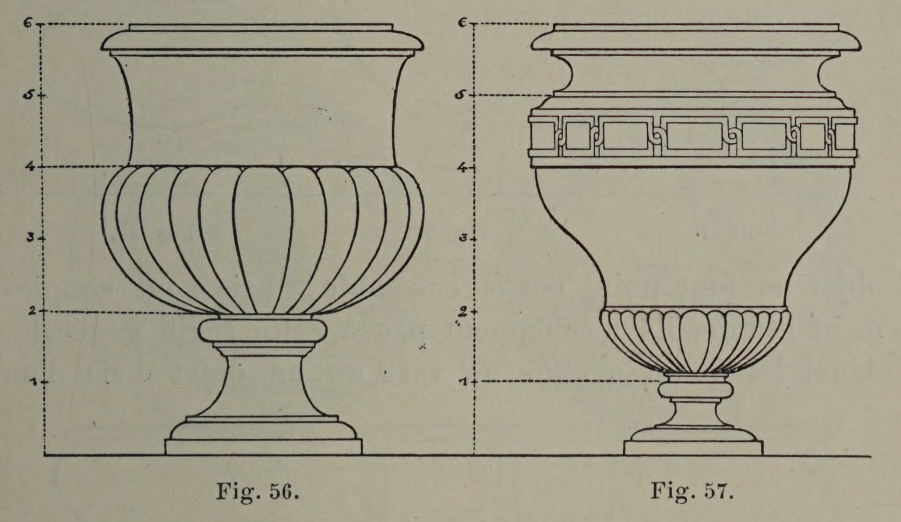
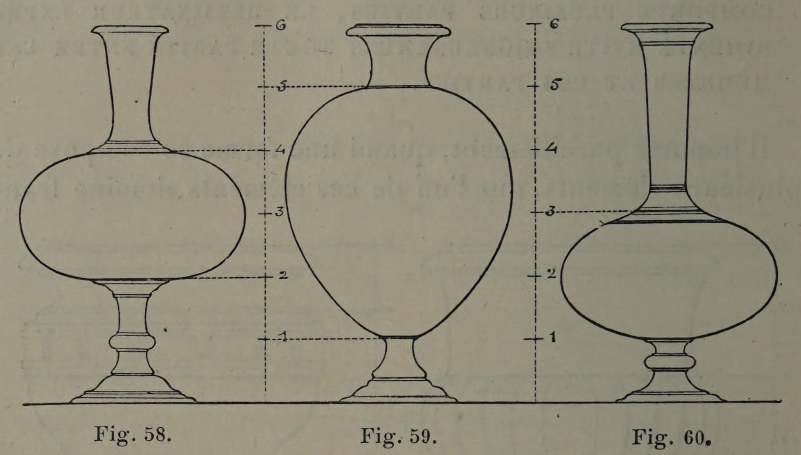
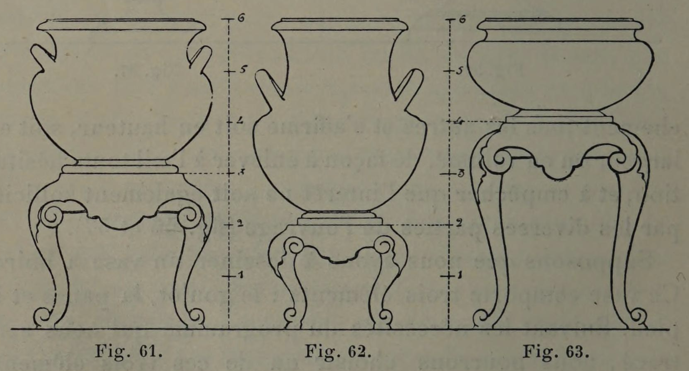

# Dominance Over Equality

## Original (French)

**LI. — LORSQUE L'OBJET DONT IL TRACE LE GALBE SE COMPOSE DE MEMBRES DIFFÉRENTS, OU LORSQUE CET OBJET COMPORTE PLUSIEURS PARTIES, LE DESSINATEUR EXPÉRIMENTÉ ÉVITE SOIGNEUSEMENT TOUTE PARITÉ ENTRE CES MEMBRES ET CES PARTIES.**

Il importe pareillement, quand une forme se compose de plusieurs éléments, que l’un de ces éléments domine franchement tous les autres et s'affirme soit en hauteur, soit en largeur ou en volume, de façon à enlever à l'œil toute hésitation, et à empêcher que l'intérêt ne soit également sollicité par les diverses parties de l'ouvrage (fig. 56 et 57). Supposons que nous ayons à dessiner un vase à boire. Ce vase comporte trois éléments : le goulot, la panse et le pied. Suivant les nécessités du programme qui nous sera tracé, nous pourrons choisir un de ces trois éléments comme partie dominante, et, en donnant tour à tour l’importance décisive soit à la panse (fig. 59), soit au goulot (fig. 60), combiner des galbes présentant un certain agrément; résultat qui ne saurait être atteint si nous octroyions à nos trois éléments des dimensions égales (fig. 58). Ce que nous disons ici d’un vase peut s'entendre d’un meuble quelconque, d'un flambeau, d'un balustre, d’un objet quel qu'il soit. Bien mieux, quand les éléments dont se compose cet objet ne font point corps ensemble, mais sont simplement réunis, ils n’échappent pas à cette règle générale. Ainsi lorsqu'on gratifie un vase ou un NES d'art support, il est indispensable qu’un des deux éléments, support ou objet, domine franchement; car l'égalité de hauteur entre les deux parties produit toujours une uniformité déplaisante (voir fig. 61 à 63).

## Translation

**LI. — When the object whose profile is being drawn is composed of different members, or when that object contains several parts, the experienced designer carefully avoids all equality between those members and parts.**

Likewise, when a form is composed of several elements, it is important that one of these elements clearly dominate all the others and assert itself either through height, width, or volume, so as to remove all hesitation from the eye and prevent attention from being equally divided among the various parts of the work (figs. 56 and 57).

Suppose we are designing a drinking vessel. This vessel contains three elements: the neck, the body, and the foot. Depending on the requirements of the program assigned to us, we may choose one of these three elements as the dominant part, and by giving decisive importance either to the body (fig. 59) or to the neck (fig. 60), we may compose profiles possessing a certain elegance; a result that could never be achieved if we granted equal dimensions to all three elements (fig. 58).

What we say here about a vase may equally be applied to any piece of furniture, a candlestick, a baluster, or indeed any object whatsoever. Better still: even when the elements composing the object do not form a single body together, but are merely associated, they still do not escape this general rule. Thus, when one places a vase or an art object upon a support, it is indispensable that one of the two elements — either the support or the object — clearly dominate; for equality in height between the two parts always produces a disagreeable uniformity (see figs. 61 to 63).

## Images

_Fig. 56., Fig. 57._

_Fig. 58., Fig. 59., Fig. 60._

_Fig. 61., Fig. 62., Fig. 63._
