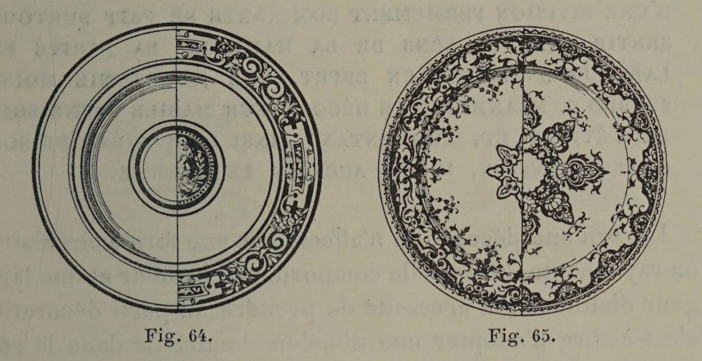

# Ornament is Hierarchical

## Original (French)

**LII. — DANS LA RÉPARTITION DE SES ORNEMENTS, LE DÉCORATEUR DOIT ÉGALEMENT PRENDRE UN PARTI, C'ESTA-DIRE ADOPTER UNE DIVISION DOMINANTE.**

Ce que nous venons de dire des proportions générales d'un ouvrage, s'applique également aux ornements qu’on répartit sur sa surface. Pour donner à sa décoration un accent de franchise et pour éviter toute uniformité fâcheuse, l'artiste ne manque pas de prendre de suite un parti, et de réserver une division dominante. Supposons qu'on nous demande de décorer de trois zones concentriques une assiette de dimensions moyennes, et supposons que le marli appelé à fournir l’une de ces zones, se trouve mesurer juste le tiers du diamètre total. Diviserons-nous (comme le montre notre figure 64) notre fond par moitié, de façon que nos trois bandes concentriques présentent une égale largeur ? Assurément non, et soit que nous n’entourions l’ombilic de notre assiette que d’une légère dentelle, soit, au contraire, que nous recouvrions la plus grande partie du fond d'un décor rayonnant (voir fig. 65), nous aurons soin de tenir nos zones sensiblement inégales, de manière à enlever à notre décor toute indécision, et par conséquent toute monotonie.

De même, si nous avons à distribuer en diverses parties, la décoration d’une paroi de muraille, d’un panneau, d’un placard, d'une porte d’armoire, etc., nous nous arrangerons de façon qu’une division dominante, en retenant les yeux et en fixant l'attention, vienne donner à notre décoration une variété suffisante pour que la monotonie ne naisse pas de la conformité des proportions.

## Translation

**LII. — In the distribution of ornaments, the decorator must likewise take a position; that is to say, adopt a dominant division.**

What we have just said concerning the general proportions of a work applies equally to the ornaments distributed across its surface. In order to give a decoration a clear and decisive character, and to avoid any unfortunate uniformity, the artist never fails from the outset to take a position and reserve a dominant division.

Suppose we are asked to decorate, with three concentric zones, a plate of متوسط dimensions, and suppose that the marli — intended to furnish one of these zones — measures exactly one-third of the total diameter. Shall we then divide the remaining surface equally in half, so that our three concentric bands present equal widths, as shown in figure 64? Certainly not. Whether we surround the ombilic of the plate with only a delicate lace-like border, or, on the contrary, cover the greater part of the center with a radiating decoration (see fig. 65), we shall take care to keep our zones noticeably unequal, so as to remove from our decoration all indecision, and consequently all monotony.

Likewise, if we must distribute decoration across various parts of a wall surface, a panel, a cabinet, a cupboard door, and so forth, we shall arrange matters so that one dominant division, by attracting the eye and fixing the attention, gives our decoration sufficient variety to prevent monotony from arising through similarity of proportions.

## Images

_Fig. 64., Fig. 65._
