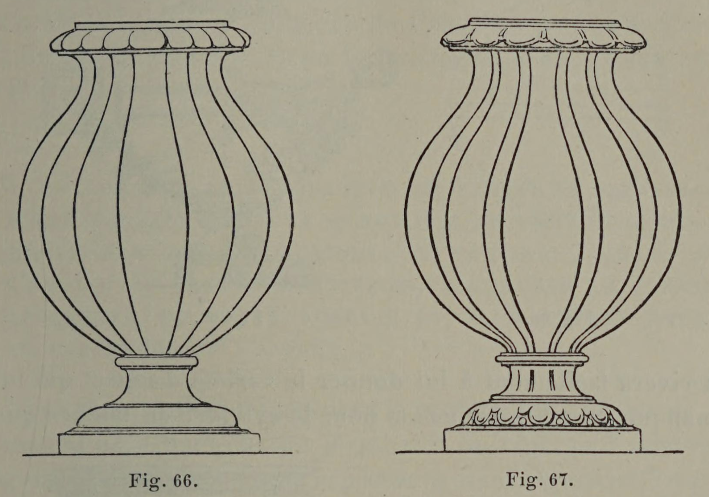

# Symmetry Needs Variation

## Original (French)

**LIII. — IL EST A REMARQUER, TOUTEFOIS, QUE CE BESOIN D’UNE DIVISION FERMEMENT DOMINANTE SE FAIT SURTOUT SENTIR DANS LE SENS DE LA HAUTEUR. LA PARITÉ EN LARGEUR ENTRAÎNE, EN EFFET, UNE MONOTONIE MOINS SENSIBLE. NÉANMOINS LE DÉCORATEUR HABILE PREND SOIN DE L'ÉVITER, ET, AUGMENTANT AINSI LA VARIÉTÉ DE SON ORNEMENTATION, IL EN ACCROÎT LE CHARME.**

Lorsqu'une décoration n'’affecte pas une forme circulaire ou rayonnante, lorsqu'elle comporte une hauteur et une largeur distinctes, la nécessité de prendre un parti décoratif, c'est-à-dire d'adopter une division dominante dans la répartition de l’ornementation, ne s'impose que dans un sens, celui de la hauteur. La largeur, en effet, subissant les lois de la symétrie, peut supporter une division en parties égales, sans que l’œil s’en trouve choqué, et sans que l’agrément en soit par trop atténué. On n'a pas oublié, au surplus, ce que nous avons dit, dans notre proposition XLIII, des avantages qui résultent de la symétrie et du plaisir qu'elle cause. Mais de quelque secours qu'elle soit pour le décorateur, son abus risquerait de dégénérer en monotonie, si le dessinateur, aussi prudent qu'habile, tout en respectant ses principes, ne s’efforçait d’atténuer ses exigences. Il y parvient ordinairement au moyen des alternances; et, grâce à celles-ci, il introduit dans sa composition une variété et une richesse qui en doublent le charme. Les deux exemples que nous donnons ici (voir fig. 66 et 67), bien que leur décoration soit réduite à sa plus simple expression et résulte seulement de lignes parallèles, feront comprendre l'avantage de ces alternances et le parti qu’on en peut tirer.

## Translation

**LIII. — It should nevertheless be observed that this need for a firmly dominant division is felt above all in the vertical direction. Equality in width produces a less noticeable monotony. Even so, the skillful decorator takes care to avoid it, and by thus increasing the variety of his ornamentation, he enhances its charm.**

When a decoration does not assume a circular or radiating form, when it possesses a distinct height and width, the necessity of taking a decorative position — that is to say, of adopting a dominant division in the distribution of ornament — imposes itself only in one direction: that of height.

Width, indeed, being subject to the laws of symmetry, can tolerate division into equal parts without offending the eye or excessively diminishing the pleasure produced. Besides, one has not forgotten what we said in Proposition XLIII concerning the advantages resulting from symmetry and the pleasure it affords.

But however useful symmetry may be to the decorator, its excessive use risks degenerating into monotony if the designer, as prudent as he is skillful, while respecting its principles, does not endeavor to soften its demands. He ordinarily succeeds in this by means of alternations; and thanks to these, he introduces into his composition a variety and richness that double its charm.

The two examples presented here (see figs. 66 and 67), although their decoration is reduced to its simplest expression and consists only of parallel lines, will make understood the advantage of these alternations and the use that may be made of them.

## Images

_Fig. 66., Fig. 67._
