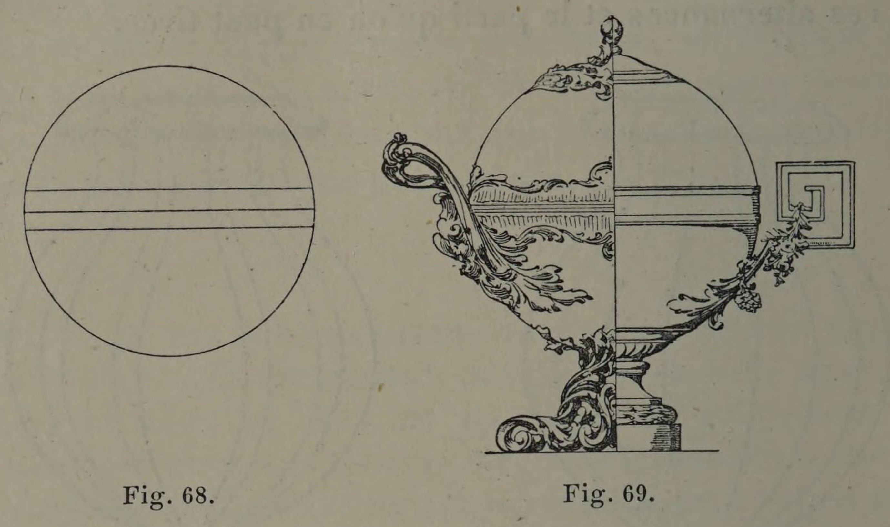
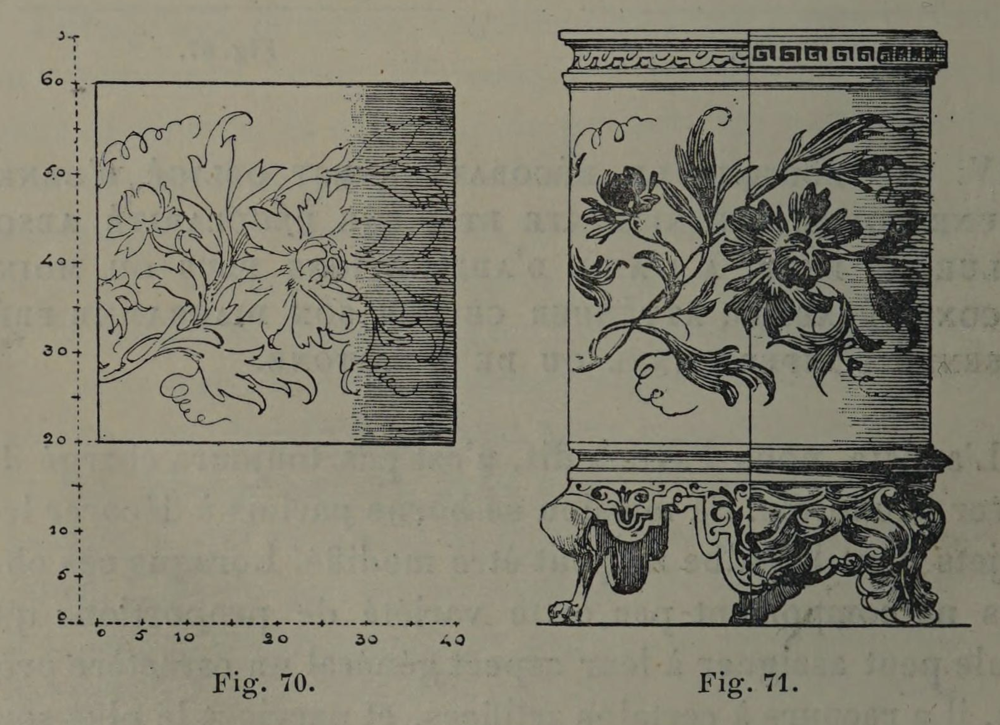

# Breaking the Monotony of Perfect Geometry

## Original (French)

**LIV. — LORSQUE LE DÉCORATEUR EST OBLIGÉ D'ORNER UNE FORME PRÉEXISTANTE ET D'UNE RÉGULARITÉ ABSOLUE, IL PEUT, A L'AIDE D'ADJONCTIONS PLUS OU MOINS CONSIDÉRABLES, ATTÉNUER CE QUE SON DIAGRAMME PRÉSENTE D'IMPERSONNEL OU DE MONOTONE.**

L'artiste, nous l'avons dit, n’est pas toujours chargé de créer une forme. Sa mission se borne parfois à décorer les objets dont le galbe ne peut être modifié. Lorsque ces objets ne comportent pas cette variété de proportions qui seule peut assigner à leur aspect général un caractère précis, il a recours à certains artifices, et parvient le plus souvent, à l’aide d’adjonctions plus ou moins importantes, à atténuer leur froideur et leur insignifiance. Prenons comme exemple la pomme d'argent absolument sphérique que représente notre figure 68. Sa forme est d’une indiscutable monotonie. Hé bien! en l’agrémentant d'un pied, de deux anses, et en la surmontant d’un bouton, un orfèvre habile arrivera facilement à lui donner la variété d'aspect qui lui manque (fig. 69). De même pour le cylindre en faïence que représente notre figure 70, et dont la forme se traduit géo-métralement par un carré. Livrez ce cylindre à un bronzier intelligent; celui-ci, en le complétant d’un rebord et d'un pied, modifiera suffisamment ses proportions pour que son galbe cesse d’être monotone. Qu'il s'agisse d’un œil-de-bœuf ou d’une horloge, dont la rotondité régulière est parfaitement déplaisante, le décorateur se tirera aisément d'affaire à l’aide d'artifices du même genre. On peut voir, du reste, à la tour de l’'Horloge du Palais de justice de Paris de quelle adorable façon le problème a été résolu au xvi\* siècle.

## Translation

**LIV. — When the decorator is obliged to ornament a preexisting form of absolute regularity, he may, by means of additions of greater or lesser importance, soften whatever his diagram presents as impersonal or monotonous.**

As we have said, the artist is not always charged with creating a form. His task is sometimes limited to decorating objects whose profile cannot be altered. When these objects do not possess that variety of proportions which alone can give their general appearance a distinct character, he resorts to certain artifices and most often succeeds, with the aid of additions more or less significant, in softening their coldness and insignificance.

Let us take as an example the perfectly spherical silver apple represented in figure 68. Its form possesses an unquestionable monotony. Very well! By embellishing it with a foot, two handles, and surmounting it with a finial, a skillful goldsmith will easily succeed in giving it the variety of appearance that it lacks (fig. 69).

Likewise with the faience cylinder represented in figure 70, whose form translates geometrically into a square. Place this cylinder in the hands of an intelligent bronze-worker; by completing it with a rim and a foot, he will sufficiently modify its proportions so that its profile ceases to be monotonous.

Whether it be an oculus window or a clock whose regular roundness is entirely displeasing, the decorator will easily extricate himself through artifices of the same kind. One may see, moreover, on the Clock Tower of the Palais de Justice in Paris, how admirably this problem was resolved in the sixteenth century.

## Images

_Fig. 68., Fig. 69._

_Fig. 70., Fig. 71._
