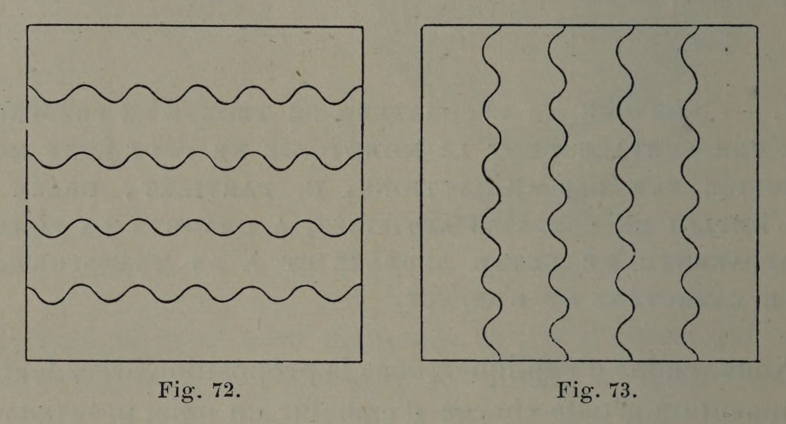
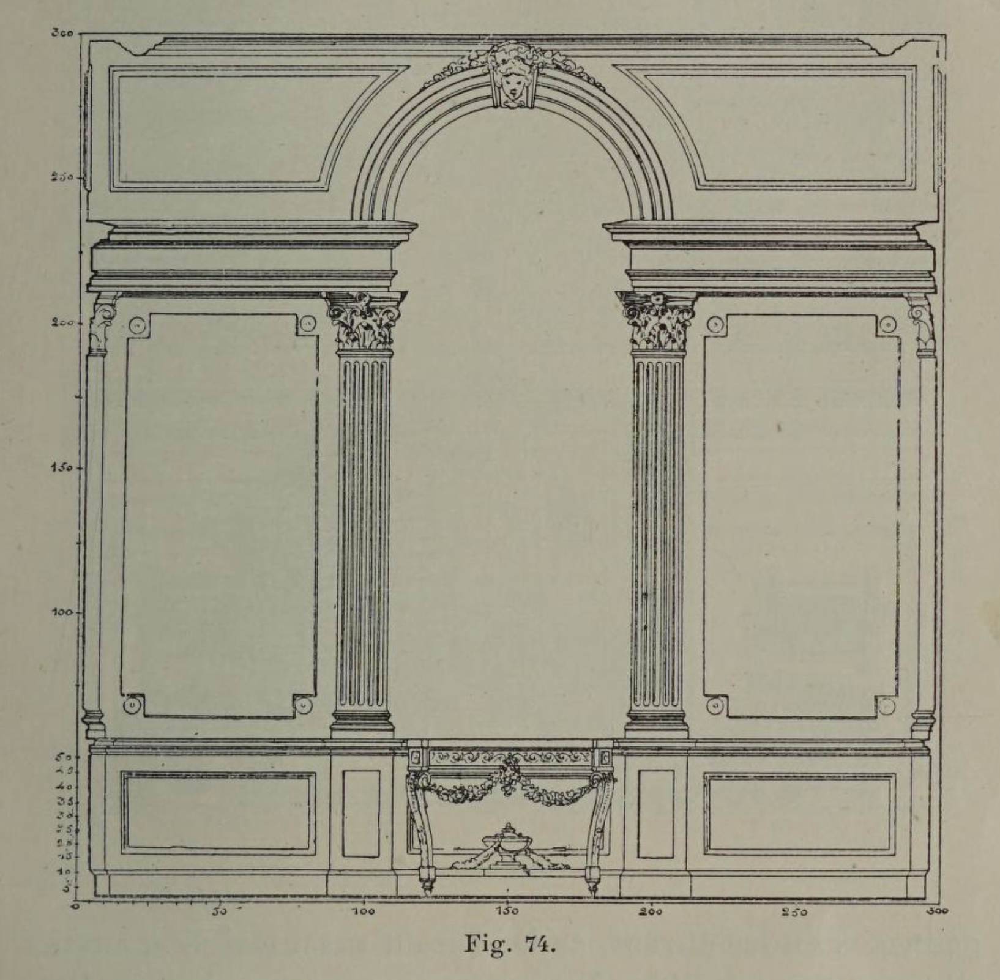

# Transforming Geometry Through Surface Articulation

## Original (French)

**LV. — LORSQUE LE DÉCORATEUR SE TROUVE EN PRÉSENCE D'UNE SURFACE DONT LA MONOTONIE NE PEUT ÊTRE MODIFIÉE PAR DES ADJONCTIONS, IL PARVIENT, GRACE A L'EMPLOI DE CERTAINS ARTIFICES, À CHANGER LA FORME APPARENTE DE CETTE SURFACÉ ET A EN TRANSFORMER LE CARACTÈRE ET L'ASPECT.**

Nous venons d'expliquer, dans la proposition précédente, comment un artiste chargé d’embellir un objet préexistant parvient, lorsque celui-ci présente une régularité trop absolue, à dissimuler à l’aide d’adjonctions l’absente de variété résultant de proportions trop équivalentes. Mais il peut arriver que le décorateur soit empêché de recourir à ce moyen, et se trouve obligé de se renfermer dans des limites d'une précision inexorable. En ce cas, soit que le rapport des dimensions de la surface ou de l’objet à décorer se trouve en contradiction avec le caractère que ceux-ci doivent avoir, soit que leurs lignes principales affectent une concordance fâcheuse, qui enlève toute expression à leur galbe, l'artiste peut, à l’aide de certains artifices, atténuer considérablement ce que ces proportions offrent de fautif.

Un des procédés les plus employés dans ce but, est la division des surfaces par des lignes parallèles. Il est clair, par exemple, que nos deux figures 72 et 73 qui, l’une et l’autre, constituent un carré parfait, perdent en apparence leur absolue régularité dès qu'elles sont divisées par des lignes ondées. Appliquant cette observation à la paroi d’un mur figurant, elle aussi, un carré, nous voyons (fig. 74) qu'il suffit de partager cette paroi en parties bien distinctes, pour que l’impression produite par cette division domine le sentiment de monotonie provoqué par la complète concordance des dimensions.

## Translation

**LV. — When the decorator finds himself confronted with a surface whose monotony cannot be modified by additions, he succeeds, through the use of certain artifices, in changing the apparent form of that surface and transforming its character and appearance.**

We have just explained, in the preceding proposition, how an artist charged with embellishing a preexisting object succeeds, when that object presents an excessively absolute regularity, in concealing through additions the absence of variety resulting from overly equivalent proportions.

But it may happen that the decorator is prevented from resorting to this means and finds himself obliged to remain within limits of inexorable precision. In such a case, whether the relationship of the dimensions of the surface or object to be decorated is in contradiction with the character that it ought to possess, or whether its principal lines display an unfortunate correspondence that deprives its profile of all expression, the artist may, through certain artifices, considerably soften what these proportions contain that is defective.

One of the methods most commonly employed for this purpose is the division of surfaces by parallel lines. It is clear, for example, that our two figures 72 and 73, both of which constitute a perfect square, apparently lose their absolute regularity once they are divided by undulating lines.

Applying this observation to the surface of a wall, itself likewise forming a square, we see (fig. 74) that it suffices to divide this surface into clearly distinct parts for the impression produced by this division to dominate the feeling of monotony provoked by the complete correspondence of the dimensions.

## Images

_Fig. 72., Fig. 73._

_Fig. 74._
